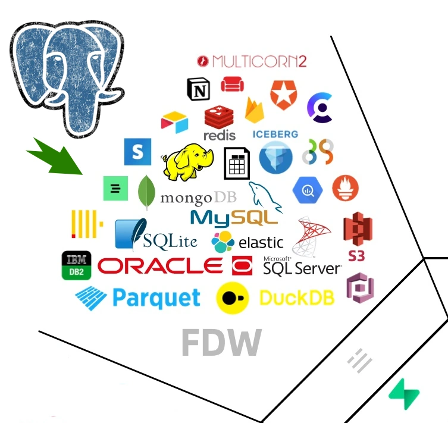
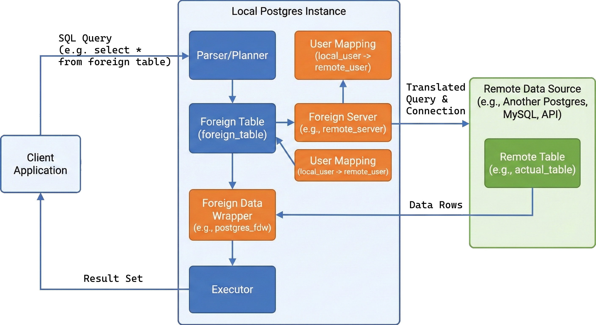

# Data Archive Solution in PostgreSQL using Foreign Data Wrappers (FDW)

## Introduction

As databases grow, managing historical data becomes a critical operational challenge. Application teams often need to retain years of data for auditing and compliance, but this data is rarely modified, mostly just queried occasionally. This creates a perfect use case for data archiving.



Traditional archiving approaches have limitations:

- **Detached partitions**: Data becomes inaccessible without reattaching
- **Backups**: Require restore operations to access data
- **Separate clusters**: Application needs multiple connection endpoints

This tutorial presents a **fourth approach**: using PostgreSQL's Foreign Data Wrapper (FDW) with partitioned tables to create a transparent, distributed archive system.

## What is Foreign Data Wrapper (FDW)?

Foreign Data Wrapper is a PostgreSQL extension that allows you to:

- Access data stored in external databases as if they were local tables
- Query remote PostgreSQL instances (or even other database systems) seamlessly
- Perform JOIN operations across different database instances
- Execute INSERT, UPDATE, and DELETE operations on remote data

**The magic**: When you query a foreign table, PostgreSQL automatically connects to the remote server, executes the query there, and returns the results. Your application sees it as a single, unified database.

## Architecture Overview

We'll build a three-tier archive system:

```bash
┌─────────────────────────────────────────────────┐
│           Instance 1 (Main/Primary)             │
│                 Port: 5432                      │
│  ┌──────────────────────────────────────────┐  │
│  │     Partitioned Table: EMP               │  │
│  │  ┌────────────┬────────────┬──────────┐ │  │
│  │  │ EMP_2023   │ EMP_2024   │ EMP_2025 │ │  │
│  │  │ (Foreign)  │ (Foreign)  │ (Local)  │ │  │
│  │  └─────┬──────┴─────┬──────┴──────────┘ │  │
│  └────────┼────────────┼───────────────────┘  │
└───────────┼────────────┼──────────────────────┘
            │            │
            │            │ FDW Connection
            ▼            ▼
┌───────────────────┐  ┌───────────────────┐
│   Instance 2      │  │   Instance 3      │
│   Port: 5433      │  │   Port: 5434      │
│ ┌───────────────┐ │  │ ┌───────────────┐ │
│ │  EMP_2023     │ │  │ │  EMP_2024     │ │
│ │  (Archive)    │ │  │ │  (Archive)    │ │
│ └───────────────┘ │  │ └───────────────┘ │
└───────────────────┘  └───────────────────┘
```

**Key Benefits**:

1. **Single endpoint**: Application always connects to Instance 1
2. **Transparent access**: Archive data accessible without code changes
3. **Independent backups**: Each instance backed up separately
4. **Faster restores**: Restore only what you need
5. **Easy decommissioning**: Drop old archives by removing instances
6. **Distributed storage**: Spread data across multiple servers


## Prerequisites

- Docker and Docker Compose installed
- Basic PostgreSQL knowledge
- At least 2GB RAM available

## Step 1: Environment Setup

### Docker Compose Configuration

Create a file named `docker-compose.yml`:

```yaml
version: '3.8'

services:
  # Main PostgreSQL instance (Active data + FDW coordinator)
  postgres1:
    image: docker.arvancloud.ir/library/postgres:18
    container_name: pg_main
    environment:
      POSTGRES_USER: postgres
      POSTGRES_PASSWORD: postgres123
      POSTGRES_DB: appdb
    ports:
      - "5432:5432"
    volumes:
      - pg1_data:/var/lib/postgresql/data
    networks:
      - pg_network
    healthcheck:
      test: ["CMD-SHELL", "pg_isready -U postgres"]
      interval: 10s
      timeout: 5s
      retries: 5

  # Archive instance for 2024 data
  postgres_2023:
    image: docker.arvancloud.ir/library/postgres:18
    container_name: pg_archive_2024
    environment:
      POSTGRES_USER: postgres
      POSTGRES_PASSWORD: postgres123
      POSTGRES_DB: archive_db
    ports:
      - "5433:5432"
    volumes:
      - pg2_data:/var/lib/postgresql/data
    networks:
      - pg_network
    healthcheck:
      test: ["CMD-SHELL", "pg_isready -U postgres"]
      interval: 10s
      timeout: 5s
      retries: 5

  # Archive instance for 2023 data
  postgres_2024:
    image: docker.arvancloud.ir/library/postgres:18
    container_name: pg_archive_2023
    environment:
      POSTGRES_USER: postgres
      POSTGRES_PASSWORD: postgres123
      POSTGRES_DB: archive_db
    ports:
      - "5434:5432"
    volumes:
      - pg3_data:/var/lib/postgresql/data
    networks:
      - pg_network
    healthcheck:
      test: ["CMD-SHELL", "pg_isready -U postgres"]
      interval: 10s
      timeout: 5s
      retries: 5

networks:
  pg_network:
    driver: bridge

volumes:
  pg1_data:
  pg2_data:
  pg3_data:
```

**Configuration Explained**:

- **postgres1**: Main instance on port 5432 (active data + FDW coordinator)
- **postgres2**: Archive for 2024 data on port 5433
- **postgres3**: Archive for 2023 data on port 5434
- **pg_network**: Bridge network allowing containers to communicate
- **Health checks**: Ensure databases are ready before proceeding

### Start the Environment

```bash
# Start all containers
docker-compose up -d

# Verify all containers are running
docker-compose ps

# Check logs if needed
docker-compose logs -f
```

Wait for all health checks to pass (about 30 seconds).

## Step 2: Configure Main Instance (postgres1)

Connect to the main PostgreSQL instance:

```bash
docker exec -it pg_main psql -U postgres -d appdb
```

### Create the Partitioned Table Structure

```sql
-- Create the parent partitioned table
CREATE TABLE emp (
    id INT NOT NULL,
    name TEXT NOT NULL,
    time TIMESTAMP NOT NULL,
    department TEXT,
    salary DECIMAL(10,2)
) PARTITION BY RANGE (time);
```

**Why partition by time?**

- Natural data lifecycle management
- Easy to identify old data for archiving
- Efficient queries with date filters
- Aligns with archival strategy (year-based)

### Create Local Partition for Current Data

```sql
-- Partition for current year (2025) - stored locally
CREATE TABLE emp_2025 PARTITION OF emp 
    FOR VALUES FROM ('2025-01-01') TO ('2026-01-01');

-- Add indexes for performance
CREATE INDEX idx_emp_2025_time ON emp_2025(time);
CREATE INDEX idx_emp_2025_name ON emp_2025(name);
```

**Note**: Keep current/hot data local for best performance. Only archive cold data.

### Enable Foreign Data Wrapper Extension

```sql
-- Enable the postgres_fdw extension
CREATE EXTENSION postgres_fdw;

-- Verify installation
\dx postgres_fdw
```

**What does postgres_fdw do?**

- Provides foreign data wrapper for PostgreSQL databases
- Handles connection pooling to remote instances
- Translates queries to remote servers
- Manages data type conversions
- Implements push-down optimization (executes filters on remote server)

### Create Foreign Server Definitions

```sql
-- Define connection to postgres2 (2024 archive)
CREATE SERVER archive_2024 
    FOREIGN DATA WRAPPER postgres_fdw 
    OPTIONS (
        host 'postgres2',           -- Container name (DNS resolution via Docker)
        dbname 'archive_db',        -- Database name on remote server
        port '5432',                -- Remote port (internal container port)
        fetch_size '10000',         -- Rows to fetch per round-trip
        use_remote_estimate 'true'  -- Use remote server's query planner
    );

-- Define connection to postgres3 (2023 archive)
CREATE SERVER archive_2023 
    FOREIGN DATA WRAPPER postgres_fdw 
    OPTIONS (
        host 'postgres3',
        dbname 'archive_db',
        port '5432',
        fetch_size '10000',
        use_remote_estimate 'true'
    );
```

**Server Options Explained**:

- `fetch_size`: Larger values = fewer network round-trips but more memory
- `use_remote_estimate`: Let remote server estimate query costs (better planning)
- `host`: Use container name (Docker DNS) not IP addresses

### Create User Mappings (Authentication)

```sql
-- Map local postgres user to remote postgres user on archive_2024
CREATE USER MAPPING FOR postgres 
    SERVER archive_2024 
    OPTIONS (
        user 'postgres',
        password 'postgres123'
    );

-- Map local postgres user to remote postgres user on archive_2023
CREATE USER MAPPING FOR postgres 
    SERVER archive_2023 
    OPTIONS (
        user 'postgres',
        password 'postgres123'
    );
```

**Security Note**: In production:

- Use dedicated service accounts with limited privileges
- Store passwords in PostgreSQL password file (~/.pgpass)
- Consider SSL/TLS connections
- Use network encryption
- Implement firewall rules

### Test Foreign Server Connections

```sql
-- Test connectivity to archive servers
SELECT * FROM pg_foreign_server;
SELECT * FROM pg_user_mappings;
```

## Step 3: Configure Archive Instances

### Setup postgres2 (2024 Archive)

Connect to postgres2:

```bash
docker exec -it pg_archive_2024 psql -U postgres -d archive_db
```

Create the archive table:

```sql
-- Create table with identical structure to main instance
CREATE TABLE emp_2024 (
    id INT NOT NULL,
    name TEXT NOT NULL,
    time TIMESTAMP NOT NULL,
    department TEXT,
    salary DECIMAL(10,2),
    -- Add constraint for data validation
    CHECK (time >= '2024-01-01' AND time < '2025-01-01')
);

-- Create indexes for query performance
CREATE INDEX idx_emp_2024_time ON emp_2024(time);
CREATE INDEX idx_emp_2024_id ON emp_2024(id);
CREATE INDEX idx_emp_2024_name ON emp_2024(name);

-- Insert sample 2024 data
INSERT INTO emp_2024 VALUES
    (1, 'Alice Johnson', '2024-03-15 09:00:00', 'Engineering', 95000.00),
    (2, 'Bob Smith', '2024-06-22 10:30:00', 'Sales', 75000.00),
    (3, 'Carol White', '2024-09-10 14:15:00', 'HR', 68000.00),
    (4, 'David Brown', '2024-11-05 11:20:00', 'Engineering', 102000.00);

-- Verify data
SELECT COUNT(*), MIN(time), MAX(time) FROM emp_2024;
```

Exit postgres2: `\q`

### Setup postgres3 (2023 Archive)

Connect to postgres3:

```bash
docker exec -it pg_archive_2023 psql -U postgres -d archive_db
```

Create the archive table:

```sql
-- Create table for 2023 archive
CREATE TABLE emp_2023 (
    id INT NOT NULL,
    name TEXT NOT NULL,
    time TIMESTAMP NOT NULL,
    department TEXT,
    salary DECIMAL(10,2),
    CHECK (time >= '2023-01-01' AND time < '2024-01-01')
);

-- Create indexes
CREATE INDEX idx_emp_2023_time ON emp_2023(time);
CREATE INDEX idx_emp_2023_id ON emp_2023(id);
CREATE INDEX idx_emp_2023_name ON emp_2023(name);

-- Insert sample 2023 data
INSERT INTO emp_2023 VALUES
    (5, 'Eve Davis', '2023-02-10 08:45:00', 'Marketing', 72000.00),
    (6, 'Frank Miller', '2023-05-18 13:00:00', 'Engineering', 98000.00),
    (7, 'Grace Lee', '2023-08-25 09:30:00', 'Sales', 82000.00),
    (8, 'Henry Wilson', '2023-12-01 15:45:00', 'Operations', 65000.00);

-- Verify data
SELECT COUNT(*), MIN(time), MAX(time) FROM emp_2023;
```

Exit postgres3: `\q`

## Step 4: Link Foreign Tables to Partitions

Return to the main instance (postgres1):

```bash
docker exec -it pg_main psql -U postgres -d appdb
```

### Create Foreign Table Partitions

```sql
-- Create foreign table partition for 2024 data
CREATE FOREIGN TABLE emp_2024 PARTITION OF emp 
    FOR VALUES FROM ('2024-01-01') TO ('2025-01-01')
    SERVER archive_2024
    OPTIONS (
        table_name 'emp_2024',      -- Remote table name
        fetch_size '10000'          -- Override default if needed
    );

-- Create foreign table partition for 2023 data
CREATE FOREIGN TABLE emp_2023 PARTITION OF emp 
    FOR VALUES FROM ('2023-01-01') TO ('2024-01-01')
    SERVER archive_2023
    OPTIONS (
        table_name 'emp_2023',
        fetch_size '10000'
    );
```

**What just happened?**

- PostgreSQL now treats remote tables as partitions
- Query routing happens automatically based on `time` column
- No application changes needed—queries use the same table name

### Add Current Year Data

```sql
-- Insert sample 2025 data (goes to local partition)
INSERT INTO emp VALUES
    (9, 'Ivy Anderson', '2025-04-12 10:00:00', 'Engineering', 105000.00),
    (10, 'Jack Thomas', '2025-07-20 11:15:00', 'Product', 92000.00),
    (11, 'Kate Martinez', '2025-10-08 14:30:00', 'Engineering', 110000.00);
```

## Step 5: Verify the Setup

### Check Partition Layout

```sql
-- View all partitions
SELECT 
    schemaname,
    tablename AS partition_name,
    pg_size_pretty(pg_total_relation_size(schemaname||'.'||tablename)) AS size
FROM pg_tables 
WHERE tablename LIKE 'emp%'
ORDER BY tablename;
```

Expected output:

```bash
 schemaname | partition_name |  size   
------------+----------------+---------
 public     | emp_2023       | 0 bytes  (foreign)
 public     | emp_2024       | 0 bytes  (foreign)
 public     | emp_2025       | 16 kB    (local)
```

### Verify Partition Routing

```sql
-- This query should automatically route to the correct partition
EXPLAIN (ANALYZE, VERBOSE)
SELECT * FROM emp WHERE time BETWEEN '2024-01-01' AND '2024-12-31';
```

Look for:

- `Foreign Scan on public.emp_2024` - confirms partition pruning
- `Filter: (time >= ...)` pushed to remote server

### Query All Data Seamlessly

```sql
-- Query spans all three instances transparently
SELECT 
    EXTRACT(YEAR FROM time) AS year,
    COUNT(*) AS employee_count,
    AVG(salary) AS avg_salary,
    MIN(time) AS earliest,
    MAX(time) AS latest
FROM emp
GROUP BY EXTRACT(YEAR FROM time)
ORDER BY year;
```

Expected output:

```bash
 year | employee_count |     avg_salary      |       earliest       |        latest        
------+----------------+---------------------+----------------------+----------------------
 2023 |              4 | 79250.00           | 2023-02-10 08:45:00 | 2023-12-01 15:45:00
 2024 |              4 | 85000.00           | 2024-03-15 09:00:00 | 2024-11-05 11:20:00
 2025 |              3 | 102333.33          | 2025-04-12 10:00:00 | 2025-10-08 14:30:00
```

**The magic**: Single query across three separate database instances!



## Step 6: Advanced Operations

### Cross-Partition Queries

```sql
-- Find employees hired in the last 3 years
SELECT id, name, time, department, salary
FROM emp
WHERE time > '2023-01-01'
ORDER BY salary DESC
LIMIT 5;

-- Department statistics across all years
SELECT 
    department,
    COUNT(*) AS total_employees,
    AVG(salary) AS avg_salary,
    MIN(time) AS first_hire,
    MAX(time) AS last_hire
FROM emp
GROUP BY department
ORDER BY avg_salary DESC;
```

### Insert Data (Automatic Routing)

```sql
-- Insert into 2023 partition (routes to postgres3)
INSERT INTO emp VALUES
    (12, 'Liam Garcia', '2023-11-15 09:00:00', 'Engineering', 97000.00);

-- Insert into 2024 partition (routes to postgres2)
INSERT INTO emp VALUES
    (13, 'Mia Rodriguez', '2024-08-20 10:30:00', 'Sales', 79000.00);

-- Insert into 2025 partition (stays local)
INSERT INTO emp VALUES
    (14, 'Noah Hernandez', '2025-11-01 11:00:00', 'Product', 95000.00);

-- Verify routing
SELECT 
    tableoid::regclass AS partition,
    id, 
    name, 
    time
FROM emp
WHERE id IN (12, 13, 14);
```

### Update and Delete Operations

```sql
-- Update works across foreign tables
UPDATE emp 
SET salary = salary * 1.05  -- 5% raise
WHERE department = 'Engineering' 
  AND time >= '2024-01-01';

-- Delete from archive (requires DELETE permission on remote)
DELETE FROM emp 
WHERE time < '2023-06-01' 
  AND department = 'Marketing';

-- Verify changes
SELECT * FROM emp WHERE id IN (1, 6) ORDER BY time;
```

### Performance Analysis

```sql
-- Compare local vs foreign table performance
EXPLAIN (ANALYZE, BUFFERS, VERBOSE)
SELECT AVG(salary) FROM emp WHERE time >= '2025-01-01';  -- Local

EXPLAIN (ANALYZE, BUFFERS, VERBOSE)
SELECT AVG(salary) FROM emp WHERE time >= '2023-01-01';  -- Cross-instance
```

**Performance Tips**:

1. Always include `time` in WHERE clauses for partition pruning
2. Create indexes on foreign tables for filtered queries
3. Use `fetch_size` tuning for large result sets
4. Monitor network latency between instances

## Step 7: Monitoring and Maintenance

### Monitor Foreign Server Statistics

```sql
-- View foreign server activity
SELECT * FROM pg_stat_foreign_tables;

-- View foreign server configuration
SELECT 
    srvname,
    srvoptions
FROM pg_foreign_server;

-- Check user mappings
SELECT 
*
FROM pg_user_mappings 
;
```

### Health Check Script

```sql
-- Create monitoring view
CREATE OR REPLACE VIEW archive_health AS
SELECT 
    'emp_2025 (local)' AS partition,
    COUNT(*) AS row_count,
    pg_size_pretty(pg_total_relation_size('emp_2025')) AS size,
    MIN(time) AS earliest,
    MAX(time) AS latest,
    'local' AS storage
FROM emp_2025

UNION ALL

SELECT 
    'emp_2024 (archive_2024)' AS partition,
    COUNT(*) AS row_count,
    '0 bytes' AS size,  -- Size is on remote server
    MIN(time) AS earliest,
    MAX(time) AS latest,
    'postgres2' AS storage
FROM emp_2024

UNION ALL

SELECT 
    'emp_2023 (archive_2023)' AS partition,
    COUNT(*) AS row_count,
    '0 bytes' AS size,
    MIN(time) AS earliest,
    MAX(time) AS latest,
    'postgres3' AS storage
FROM emp_2023;

-- Run health check
SELECT * FROM archive_health;
```

### Backup Strategy

```bash
# Backup main instance (active data only)
docker exec pg_main pg_dump -U postgres -d appdb \
    --table=emp_2025 \
    -Fc -f /tmp/emp_2025.dump

# Backup archive instances separately
docker exec pg_archive_2024 pg_dump -U postgres -d archive_db \
    -Fc -f /tmp/emp_2024.dump

docker exec pg_archive_2023 pg_dump -U postgres -d archive_db \
    -Fc -f /tmp/emp_2023.dump
```

**Benefits**:

- Smaller backup files
- Faster backup/restore operations
- Independent recovery points
- Parallel backup execution

## Step 8: Adding New Archive Partitions

As time progresses, you'll need to archive 2025 data. Here's how:

### 1. Prepare New Archive Instance

Add to `docker-compose.yml`:

```yaml
  postgres4:
    image: docker.arvancloud.ir/library/postgres:18
    container_name: pg_archive_2025
    environment:
      POSTGRES_USER: postgres
      POSTGRES_PASSWORD: postgres123
      POSTGRES_DB: archive_db
    ports:
      - "5435:5432"
    volumes:
      - pg4_data:/var/lib/postgresql/data
    networks:
      - pg_network
```

```bash
docker-compose up -d postgres4
```

### 2. Setup Archive Table on postgres4

```bash
docker exec -it pg_archive_2025 psql -U postgres -d archive_db
```

```sql
CREATE TABLE emp_2025 (
    id INT NOT NULL,
    name TEXT NOT NULL,
    time TIMESTAMP NOT NULL,
    department TEXT,
    salary DECIMAL(10,2),
    CHECK (time >= '2025-01-01' AND time < '2024-01-01')
);

CREATE INDEX idx_emp_2025_time ON emp_2025(time);
CREATE INDEX idx_emp_2025_id ON emp_2025(id);
```

### 3. Migrate Data from Main Instance

On postgres1:

```sql
-- Create foreign server for new archive
CREATE SERVER archive_2025 
    FOREIGN DATA WRAPPER postgres_fdw 
    OPTIONS (host 'postgres4', dbname 'archive_db', port '5432');

CREATE USER MAPPING FOR postgres 
    SERVER archive_2025 
    OPTIONS (user 'postgres', password 'postgres123');

-- Create temporary foreign table for migration
CREATE FOREIGN TABLE emp_2025_archive 
    SERVER archive_2025
    OPTIONS (table_name 'emp_2025');

-- Copy data to archive
INSERT INTO emp_2025_archive 
SELECT * FROM emp_2025;

-- Verify migration
SELECT COUNT(*) FROM emp_2025_archive;

-- Detach local partition
ALTER TABLE emp DETACH PARTITION emp_2025;

-- Drop local partition
DROP TABLE emp_2025;

-- Attach as foreign partition
CREATE FOREIGN TABLE emp_2025 PARTITION OF emp 
    FOR VALUES FROM ('2025-01-01') TO ('2024-01-01')
    SERVER archive_2025
    OPTIONS (table_name 'emp_2025');

-- Clean up temporary table
DROP FOREIGN TABLE emp_2025_archive;
```

## Step 9: Decommissioning Old Archives

When data is no longer needed (e.g., after retention period):

```sql
-- On main instance: Detach the partition
ALTER TABLE emp DETACH PARTITION emp_2023;

-- Drop the foreign table
DROP FOREIGN TABLE emp_2023;

-- Optional: Drop server and user mapping
DROP USER MAPPING FOR postgres SERVER archive_2023;
DROP SERVER archive_2023;
```

```bash
# Stop and remove the container
docker-compose stop postgres3
docker-compose rm -f postgres3

# Remove the volume (CAUTION: Data will be lost!)
docker volume rm <project>_pg3_data
```

## Production Best Practices

### 1. Security Hardening

```sql
-- Use dedicated read-only user for application queries
CREATE USER app_reader WITH PASSWORD 'secure_password';
GRANT SELECT ON emp TO app_reader;

-- Use dedicated service account for FDW
CREATE USER fdw_service WITH PASSWORD 'strong_password';
GRANT SELECT, INSERT, UPDATE, DELETE ON emp_2023 TO fdw_service;

-- Update user mapping
ALTER USER MAPPING FOR postgres SERVER archive_2023
    OPTIONS (SET user 'fdw_service', SET password 'strong_password');
```

### 2. Connection Pooling

Configure `postgresql.conf` on main instance:

```ini
# Adjust for FDW workload
max_connections = 200
shared_buffers = 4GB
work_mem = 32MB

# FDW-specific
postgres_fdw.use_remote_estimate = on
```

### 3. Monitoring Queries

```sql
-- Active foreign server connections
SELECT 
    datname,
    usename,
    application_name,
    client_addr,
    state,
    query
FROM pg_stat_activity
WHERE application_name LIKE 'postgres_fdw%';

-- Foreign table access statistics
SELECT 
    schemaname,
    relname,
    seq_scan,
    seq_tup_read,
    idx_scan,
    idx_tup_fetch
FROM pg_stat_user_tables
WHERE relname LIKE 'emp_%';
```

### 4. Error Handling

```sql
-- Test foreign server connectivity
DO $$
DECLARE
    result INTEGER;
BEGIN
    SELECT 1 FROM emp_2023 LIMIT 1 INTO result;
    RAISE NOTICE 'Archive 2023 is accessible';
EXCEPTION
    WHEN OTHERS THEN
        RAISE WARNING 'Archive 2023 connection failed: %', SQLERRM;
END $$;
```

## Troubleshooting

### Connection Issues

```sql
-- Test server connectivity
SELECT * FROM pg_foreign_server WHERE srvname = 'archive_2023';

-- Verify user mapping
SELECT * FROM pg_user_mappings WHERE srvname = 'archive_2023';

-- Check if remote server is reachable
\! docker exec pg_main pg_isready -h postgres3 -p 5432
```

### Performance Issues

```sql
-- Increase fetch size for large queries
ALTER SERVER archive_2023 OPTIONS (SET fetch_size '50000');

-- Disable remote estimates if causing slowdowns
ALTER SERVER archive_2023 OPTIONS (SET use_remote_estimate 'false');

-- Add indexes on remote tables
-- (Connect to remote server and create indexes)
```

### Data Consistency

```sql
-- Verify partition constraints
SELECT 
    conname,
    conrelid::regclass,
    pg_get_constraintdef(oid)
FROM pg_constraint
WHERE conrelid::regclass::text LIKE 'emp_%';

-- Check for partition gaps
SELECT 
    tablename,
    pg_get_expr(relpartbound, oid) AS partition_bounds
FROM pg_class
JOIN pg_tables ON tablename = relname
WHERE tablename LIKE 'emp_%'
ORDER BY tablename;
```

## Cleanup

To tear down the entire environment:

```bash
# Stop all containers
docker-compose down

# Remove volumes (WARNING: All data will be lost)
docker-compose down -v

# Remove images
docker rmi docker.arvancloud.ir/library/postgres:18
```

## Conclusion

You've successfully implemented a distributed archive system using PostgreSQL FDW and partitioning! This architecture provides:

✅ **Transparent access**: Query all data from a single endpoint  
✅ **Operational efficiency**: Independent backups and maintenance  
✅ **Scalability**: Distribute load across multiple instances  
✅ **Flexibility**: Easy to add/remove archive instances  
✅ **Cost optimization**: Use different hardware tiers for hot vs cold data  

### Key Takeaways

1. **FDW enables transparent distributed queries** across PostgreSQL instances
2. **Partitioning + FDW** = Powerful archival strategy
3. **Automatic query routing** based on partition key (timestamp)
4. **No application changes** required for archive access
5. **Independent scaling** of active and archive storage

### Next Steps

- Implement automated partition creation with pg_cron
- Set up monitoring with Prometheus/Grafana
- Configure SSL/TLS for inter-instance communication
- Explore pg_partman for partition management automation
- Consider using tablespaces for storage tiering

### Real-World Use Cases

- **E-commerce**: Order history (current + 5 years of archives)
- **Banking**: Transaction logs (hot + cold storage)
- **Healthcare**: Patient records (HIPAA retention compliance)
- **SaaS**: User activity logs (recent + historical analytics)
- **IoT**: Sensor data (real-time + time-series archives)

----

**Further Reading**:

- [PostgreSQL Foreign Data Wrappers Documentation](https://www.postgresql.org/docs/current/postgres-fdw.html)
- [Table Partitioning Best Practices](https://www.postgresql.org/docs/current/ddl-partitioning.html)
- [pg_partman Extension](https://github.com/pgpartman/pg_partman)
