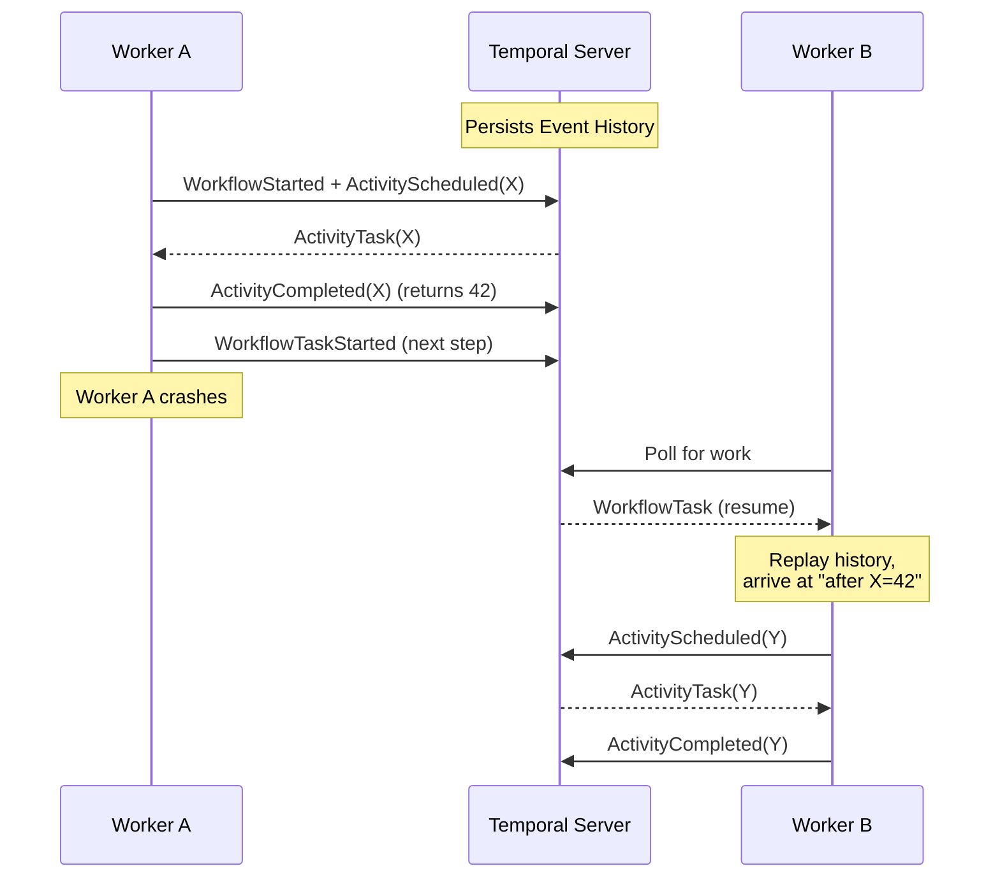
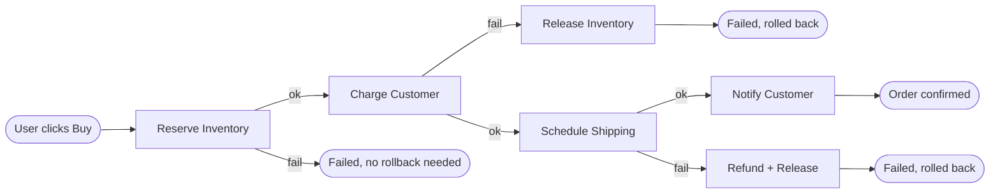

# Temporal Advanced Workshop

> Part 2 of 2. New here? Start at the [main README](./README.md) for prerequisites and the Temporal install guide. Need the basics first? Read [Workshop-Basic.md](./Workshop-Basic.md) first.
>
> A self-paced, hands-on workshop for developers who have finished Temporal Hands-On Tutorial and want to learn the production patterns that distinguish "Temporal users" from "Temporal engineers."

---

## Table of Contents

0. [Who this workshop is for](#0-who-this-workshop-is-for)
1. [The Failure-First Mindset](#1-the-failure-first-mindset)
2. [Workflows are Durable Async Event Loops](#2-workflows-are-durable-async-event-loops)
3. [The Saga Pattern in Practice](#3-the-saga-pattern-in-practice)
4. [Retry Policies: Forward vs. Backward Recovery](#4-retry-policies-forward-vs-backward-recovery)
5. [Long-Running Workflows and Continue-As-New](#5-long-running-workflows-and-continue-as-new)
6. [Signals, Queries, and Updates](#6-signals-queries-and-updates)
7. [Activity Heartbeats for Long-Running Work](#7-activity-heartbeats-for-long-running-work)
8. [Versioning Safely with Patching](#8-versioning-safely-with-patching)
9. [Search Attributes and Observability](#9-search-attributes-and-observability)
10. [Production Anti-Patterns](#10-production-anti-patterns)
11. [Hands-On Lab: A Resilient Order Pipeline](#11-hands-on-lab-a-resilient-order-pipeline)
12. [Resources and Further Reading](#12-resources-and-further-reading)

---

## 0. Who this workshop is for

You should already know:

- What a **Workflow** and an **Activity** are.
- How to run `temporal server start-dev` and connect a Worker to it.
- How to start a Workflow Execution with a Client.
- Python `async/await` syntax (coroutines, `asyncio`, `await`). This workshop uses async code extensively.

If any of those are new, finish [Temporal 101](https://learn.temporal.io/courses/temporal_101/) first, then come back. For async Python, read the [asyncio docs](https://docs.python.org/3/library/asyncio.html).

**What you will learn:**

- Why "failure management" is a strategic skill, not an afterthought.
- How Temporal's Python SDK piggybacks on `asyncio` to give you a durable event loop for free.
- How to build compensating-transaction ("Saga") workflows that undo their work on failure.
- How to design retry policies that distinguish transient, intermittent, and permanent errors.
- How to keep a Workflow running for years without hitting the 50K-event history limit.
- How to safely change Workflow code while old Workflow Executions are still running.
- How to expose Workflow state to the outside world (Signals, Queries, Updates).
- How to find and filter Workflows at scale (Search Attributes).
- Which Temporal anti-patterns to avoid before they bite you in production.

**Conventions used in this workshop:**

- Code is in Python 3.13+ using the `temporalio` SDK.
- Each example is a single file you can copy into a project and `uv run` it.
- Mermaid diagrams are shown alongside ASCII versions for renderers that do not support Mermaid.
- All code blocks use only the official Temporal Python API; no extra dependencies.

---

## 1. The Failure-First Mindset

> **Source inspiration:** Sergey Bykov, *Why top developers prioritize failure management* ([temporal.io/blog](https://temporal.io/blog/why-top-developers-focus-failures-not-code)); Sanh Doan, *From Workflow Chaos to Clarity* ([Medium](https://freedium-mirror.cfd/https://medium.com/%40sanhdoan/from-workflow-chaos-to-clarity-my-journey-with-temporal-io-cf684851b754)).

### 1.1 The amateur / professional divide

> "Amateurs focus on algorithms. Professionals focus on failures."
> -- Sergey Bykov, Temporal CTO

Most code is written for the happy path. The professional question is: **what happens when this fails, and how do I detect and recover from it?**

Sanh Doan's team learned this the hard way. Before Temporal, their order service was a "perfect storm":

- **State machine nightmares.** Order state was scattered across multiple databases, message queues, and custom trackers. Reconstructing history required detective work.
- **Failure recovery headaches.** Errors were handled with bespoke retry logic, dead-letter queues, and manual intervention.
- **Visibility problems.** "Where is the order stuck?" required piecing together logs from many systems.
- **Testing complexity.** End-to-end testing of workflows was nearly impossible without expensive integration environments.

After adopting Temporal, three things changed:

1. The complete state of each workflow execution is **durable by default**.
2. The workflow definition is **plain code**, not XML/JSON/YAML.
3. Retries, timeouts, and state recovery are **built into the platform**.

### 1.2 Three approaches to coordination

| Approach | Strengths | Weaknesses |
|---|---|---|
| **RPC (request/response)** | Simple, low latency on the happy path | Client owns all error handling, recovery, and retries |
| **Persistent queues** (RabbitMQ, Bull, Kafka) | Decoupled, automatic retries, load smoothing | Loss of ordering, dead-letter queues, limited visibility |
| **Workflows** (Temporal) | Built-in resilience, long-running support, full visibility | Requires dedicated infrastructure (which Temporal provides) |

### 1.3 The mental shift

When you write a Temporal Workflow, you are no longer writing "what should happen when the user clicks Buy." You are writing:

> "Here is the complete description of how an order is processed, from start to finish, including what to do at every point of partial failure."

Temporal persists that description as an **Event History**. If a worker crashes mid-execution, another worker can pick up the same Event History and **replay** the workflow deterministically to the exact point where the first one died.

**ASCII diagram - the replay loop:**

```
   Worker A                 Temporal Server              Worker B
   (running)                                          (just started)
       |                                                    |
       |-- "started, scheduled activity X" ---------------->|
       |<-- "X is in progress" -----------------------------|
       |  (crashes!)                                        |
       |                                                    |
       |                                          "Hey, history says I'm
       |                                           at activity X. Let me
       |                                           replay up to that point."
       |                                                    |
       |                                            +-------+
       |                                            |  RUN  |  <-- replays
       |                                            +-------+     the history
       |                                                    |
       |                                            "Activity X returned 42"
       |                                            <----- continue ----->
       |                                            "scheduled activity Y"
```

**Mermaid version:**



### 1.4 The five questions every Workflow author should ask

1. **What state am I persisting?** (Always via Activities, never via in-memory structures that aren't deterministic.)
2. **What non-deterministic things am I doing in the Workflow?** (Move them to Activities.)
3. **What is the right timeout for each Activity?** (`start_to_close_timeout` matters more than you think.)
4. **What is the right retry policy?** (Exponential backoff + `non_retryable_error_types`.)
5. **How will an operator debug this when it fails at 3 AM?** (Search Attributes, structured logging, descriptive Activity names.)

---

## 2. Workflows are Durable Async Event Loops

> **Source inspiration:** Chad Retz, *Temporal Python SDK: A durable, distributed asyncio event loop* ([temporal.io/blog](https://temporal.io/blog/durable-distributed-asyncio-event-loop)); Tihomir Surdilovic, *My journey to Temporal* ([temporal.io/blog](https://temporal.io/blog/tihomir-journey-to-temporal)).

### 2.1 The key insight

Temporal's Python SDK is **not** a smart client. It is a full state machine that runs on your worker. The Workflow method you write is a coroutine on a custom `asyncio.AbstractEventLoop` that:

1. Runs all ready coroutines cooperatively until they all yield.
2. Sends the collected commands to the Temporal server.
3. Waits for new events back (activity completions, timer firings, signals).
4. Re-fills the yielded values and runs again.

This means **every `await` in a Workflow is a checkpoint**. If the worker crashes, Temporal knows exactly which coroutine yielded on which event, and another worker can resume from that checkpoint.

### 2.2 What is "durable" about `asyncio.sleep`?

Inside a Workflow, this is **not** a normal sleep:

```python
@workflow.defn
class OrderWorkflow:
    @workflow.run
    async def run(self, order_id: str) -> str:
        await asyncio.sleep(60 * 60 * 24)  # 1 day
        await workflow.execute_activity(send_reminder, order_id, ...)
        return "reminded"
```

The sleep is implemented as a **Temporal timer**. After the worker yields on the timer, the Workflow does not run again for 24 hours. Meanwhile, the worker is free to process other workflows. When the timer fires, the server sends an event back, the worker rehydrates the coroutine, and execution continues.

In the Web UI you will see this as a `TimerStarted` / `TimerFired` event pair in the history.

### 2.3 What you can use in a Workflow

| Construct | Safe? | Why |
|---|---|---|
| `await asyncio.sleep(t)` | Yes | Implemented as a Temporal timer |
| `await asyncio.gather(...)` | Yes | Standard Python, deterministic |
| `await workflow.execute_activity(...)` | Yes | Records the command for the server |
| `await workflow.execute_child_workflow(...)` | Yes | Records the child start |
| `await workflow.wait_condition(lambda: x)` | Yes | Special Temporal primitive |
| `asyncio.Event()`, `asyncio.Queue()` | Yes | Set/wake from Signal handlers |
| `time.sleep(t)` | **No** | Blocks the worker; no progress recorded |
| `requests.get(...)` | **No** | Non-deterministic; belongs in an Activity |
| `random.random()` | **No** | Non-deterministic across replays |
| `datetime.now()` | **No** | Use `workflow.now()` instead |
| `open("file").read()` | **No** | Side effect; belongs in an Activity |

### 2.4 Live example: a self-modifying workflow

The following example shows a Workflow that waits for an external condition, but only as long as a deadline allows.

```python
import asyncio
from datetime import timedelta
from dataclasses import dataclass
from temporalio import workflow


@dataclass
class DeadlineInput:
    deadline_seconds: int


@workflow.defn
class DurableTimerWorkflow:
    def __init__(self) -> None:
        self.approved = False

    @workflow.run
    async def run(self, input: DeadlineInput) -> str:
        workflow.logger.info("Waiting for approval (or timeout)...")

        try:
            await workflow.wait_condition(
                lambda: self.approved,
                timeout=timedelta(seconds=input.deadline_seconds),
            )
        except asyncio.TimeoutError:
            return "timeout"

        return "approved"

    @workflow.signal
    def approve(self) -> None:
        self.approved = True
```

The `wait_condition` is the only safe way to combine a timer with a Signal in a Workflow. It runs its callback on every event loop iteration; the workflow is interrupted as soon as the condition is true OR the timeout fires.

### 2.5 The Rust core and the sandbox

The Python SDK is a thin layer on top of a Rust core shared with the TypeScript SDK. Two consequences:

1. The Workflow sandbox re-imports the file containing the Workflow on every replay, then proxies known non-deterministic calls (`time`, `random`, `uuid`) to give them deterministic values. This is why activities must be imported with `with workflow.unsafe.imports_passed_through():`.
2. Heartbeating and cancellation work seamlessly across threads and processes - even for sync or multiprocess activities.

---

## 3. The Saga Pattern in Practice

> **Source inspiration:** Tim Imkin, *Mastering Saga patterns for distributed transactions in microservices* ([temporal.io/blog](https://temporal.io/blog/mastering-saga-patterns-for-distributed-transactions-in-microservices)); Sanh Doan, *From Workflow Chaos to Clarity* ([Medium](https://freedium-mirror.cfd/https://medium.com/%40sanhdoan/from-workflow-chaos-to-clarity-my-journey-with-temporal-io-cf684851b754)).

### 3.1 The problem

A user places an order. You need to:

1. Reserve inventory.
2. Charge the credit card.
3. Schedule shipping.
4. Notify the customer.

In a distributed system, any of these can fail. Traditional ACID transactions do not span services. You need a way to keep the system consistent when step 2 or 3 fails after step 1 succeeded.

### 3.2 Two flavors of saga

| Style | Who drives the next step? | Visibility | Best for |
|---|---|---|---|
| **Choreography** | Each service listens for events and acts on them | Low (scattered across services) | Simple flows with few participants |
| **Orchestration** | A central Workflow coordinates the steps and the compensations | High (one place to look) | Complex multi-step business processes |

Temporal is built for **orchestration**. The Workflow IS the orchestrator.

### 3.3 Compensation in Temporal

Compensation = "undo step N." Unlike a database rollback, it is a **forward-moving Activity that happens to invert the effect of an earlier Activity.** For example, after a successful `ChargeCustomer` Activity, the compensation is a `RefundCustomer` Activity.

The Workflow knows the order of steps and the right compensation to call. It does not require global locks or 2PC.

### 3.4 Live example: order saga

The following example shows a complete saga with three steps and three compensations.

```python
import asyncio
from dataclasses import dataclass
from datetime import timedelta
from temporalio import workflow
from temporalio.common import RetryPolicy


@dataclass
class OrderInput:
    order_id: str
    amount_cents: int


class Activities:
    @staticmethod
    async def reserve_inventory(order_id: str) -> str: ...
    @staticmethod
    async def release_inventory(reservation_id: str) -> None: ...
    @staticmethod
    async def charge_customer(order_id: str, amount_cents: int) -> str: ...
    @staticmethod
    async def refund_customer(charge_id: str) -> None: ...
    @staticmethod
    async def schedule_shipping(order_id: str) -> str: ...
    @staticmethod
    async def cancel_shipping(shipment_id: str) -> None: ...
    @staticmethod
    async def notify_customer(order_id: str, status: str) -> None: ...


@workflow.defn
class OrderSagaWorkflow:
    @workflow.run
    async def run(self, input: OrderInput) -> str:
        retry = RetryPolicy(maximum_attempts=3, maximum_interval=timedelta(seconds=10))
        timeout = timedelta(minutes=2)
        a = workflow.activity

        try:
            reservation_id = await a.execute_activity_method(
                Activities.reserve_inventory, input.order_id,
                start_to_close_timeout=timeout, retry_policy=retry,
            )
            charge_id = await a.execute_activity_method(
                Activities.charge_customer, input.order_id, input.amount_cents,
                start_to_close_timeout=timeout, retry_policy=retry,
            )
            shipment_id = await a.execute_activity_method(
                Activities.schedule_shipping, input.order_id,
                start_to_close_timeout=timeout, retry_policy=retry,
            )
            await a.execute_activity_method(
                Activities.notify_customer, input.order_id, "confirmed",
                start_to_close_timeout=timeout, retry_policy=retry,
            )
            return "completed"

        except Exception as e:
            workflow.logger.warning("Order failed, compensating: %s", e)
            await self.compensate(input, reservation_id, charge_id, shipment_id)
            return "rolled_back"

    async def compensate(self, input, reservation_id, charge_id, shipment_id):
        a = workflow.activity
        timeout = timedelta(minutes=2)
        if shipment_id:
            try:
                await a.execute_activity_method(
                    Activities.cancel_shipping, shipment_id,
                    start_to_close_timeout=timeout,
                )
            except Exception:
                pass
        if charge_id:
            try:
                await a.execute_activity_method(
                    Activities.refund_customer, charge_id,
                    start_to_close_timeout=timeout,
                )
            except Exception:
                pass
        if reservation_id:
            try:
                await a.execute_activity_method(
                    Activities.release_inventory, reservation_id,
                    start_to_close_timeout=timeout,
                )
            except Exception:
                pass
        try:
            await a.execute_activity_method(
                Activities.notify_customer, input.order_id, "rolled_back",
                start_to_close_timeout=timeout,
            )
        except Exception:
            pass
```

**Key takeaways:**

- The Workflow is the single source of truth for the order's lifecycle.
- Compensations are themselves Activities (with their own timeouts and retries).
- A failed compensation **does not crash the Workflow** - it is logged and the saga still rolls back as far as it can. In a real system, you would route permanently-stuck compensations to a human-in-the-loop queue.
- The compensations run in the same Workflow Execution - they benefit from the same history, visibility, and retry guarantees as the forward path.

### 3.5 The "saga as sequence diagram" mental model



---

## 4. Retry Policies: Forward vs. Backward Recovery

> **Source inspiration:** Fitz, *Failure handling in practice: Master Workflow retry logic for resilient applications* ([temporal.io/blog](https://temporal.io/blog/failure-handling-in-practice)).

### 4.1 The two dimensions of failure

**Where** the failure happens (spatial):

- **Platform-level** errors are caused by the network, the OS, the load balancer. Retry them.
- **Application-level** errors are caused by the business logic. Retrying without changes is futile. Example: `InsufficientFundsError`.

**When** the failure happens (temporal):

- **Transient.** Resolves in milliseconds. Retry immediately.
- **Intermittent.** Resolves in seconds. Retry with exponential backoff.
- **Permanent.** Will not resolve without external action. Mark as `non_retryable`.

### 4.2 The Temporal Retry Policy

```python
from datetime import timedelta
from temporalio.common import RetryPolicy

retry = RetryPolicy(
    initial_interval=timedelta(seconds=1),
    backoff_coefficient=2.0,
    maximum_interval=timedelta(seconds=60),
    maximum_attempts=10,
    non_retryable_error_types=["InsufficientFundsError", "AuthFailure"],
)
```

The delay before attempt N (after the first failure) is:

```
delay(N) = min(maximum_interval, initial_interval * backoff_coefficient ** (N - 1))
```

With `initial_interval=1s, backoff_coefficient=2.0`:

| Attempt | Delay before | Total elapsed |
|---|---|---|
| 1 | 0 s | 0 s |
| 2 | 1 s | 1 s |
| 3 | 2 s | 3 s |
| 4 | 4 s | 7 s |
| 5 | 8 s | 15 s |
| 6 | 16 s | 31 s |
| 7 | 32 s | 63 s |
| 8 | 60 s (capped) | 123 s |

### 4.3 The two recovery strategies

- **Forward recovery.** Retry until it works. The user sees nothing. Use for transient/intermittent errors.
- **Backward recovery.** Undo committed work via compensations. Use for permanent errors or after retry budget is exhausted.

### 4.4 Marking errors as non-retryable

In Python, raise `ApplicationError` with `non_retryable=True`:

```python
from temporalio.exceptions import ApplicationError

@activity.defn
async def charge_customer(order_id: str, amount_cents: int) -> str:
    try:
        return await stripe.Charge.create(order_id, amount_cents)
    except stripe.AuthenticationError as e:
        raise ApplicationError(
            "Stripe auth failed; will not retry",
            type="AuthFailure",
            non_retryable=True,
        ) from e
```

Now this exception skips the retry policy entirely and fails the Activity immediately. The Workflow can then trigger compensation logic.

### 4.5 Always set `maximum_attempts` and `maximum_interval`

Fitz's example: the Google Nearby Places API costs $0.032 per call. Retrying it every second for an hour = $115.20 for **one** failed workflow. Without caps, a bad retry policy can burn real money.

### 4.6 Decision tree

```
Activity failed
├─ Is it a known permanent error?
│   ├─ Yes -> raise ApplicationError(non_retryable=True)
│   └─ No  -> use the retry policy
│
└─ After retry policy is exhausted
    ├─ Can I compensate? -> run the saga's compensation block
    └─ No compensation possible -> fail the workflow, alert a human
```

---

## 5. Long-Running Workflows and Continue-As-New

> **Source inspiration:** Fitz, *Managing very long-running Workflows with Temporal* ([temporal.io/blog](https://temporal.io/blog/very-long-running-workflows)).

### 5.1 The hard limits

A single Workflow Execution can have at most:

- **51,200 events** in its Event History, OR
- **50 MB** of total history size

When either is reached, the server **terminates** the Workflow with an error.

For a workflow that runs for years (a customer subscription, a sensor proxy, a digital twin), the only way to keep going is **Continue-As-New**.

### 5.2 What is Continue-As-New?

`Continue-As-New` is the SDK feature that lets a Workflow say:

> "I'm done with this run. Please start a new run of the same Workflow type with the same Workflow ID, but with a fresh Event History. Pass my current state as the new input."

In Python:

```python
import workflow

if workflow.info().is_continue_as_new_suggested():
    workflow.continue_as_new(current_state)
```

The SDK records a single `WorkflowExecutionContinuedAsNew` event in the old run and a `WorkflowExecutionStarted` event in the new run. Same `workflow_id`, new `run_id`. Signal/Query senders that omit `run_id` automatically go to the latest run, so external systems are unaffected.

### 5.3 When to call it

The Temporal server **suggests** Continue-As-New after about 10K events. You can read the suggestion with `workflow.info().is_continue_as_new_suggested()`. Practical heuristics:

| Workflow shape | Events per "cycle" | Suggested CAN after |
|---|---|---|
| No Activities (just started, ran, completed) | 5 | N/A |
| One Activity | 11 | 4,500 runs |
| One Activity per loop iteration | 6 per iteration | 8,300 iterations |
| One Timer | 10 | 5,000 timers |
| One Signal (processed) | 9 | 5,500 signals |

For a monthly-billing subscription that sleeps 30 days, performs one Activity, and continues-as-new, you would call Continue-As-New **once per billing cycle**. This keeps the history tiny indefinitely.

### 5.4 Things that die during Continue-As-New

| Thing | What happens | What to do |
|---|---|---|
| **Pending Signals** | Lost | Drain and process all Signals **before** calling Continue-As-New |
| **Pending Activities** | Cancelled | Await their results, or accept cancellation |
| **Child Workflows** | Terminated by default | Use `parent_close_policy=workflow.ParentClosePolicy.ABANDON` |
| **Workflow ID** | Same | External systems can still find you |
| **Run ID** | New | Don't cache Run IDs! |

### 5.5 Live example: a monthly subscription

The following example shows a Workflow that bills once a month, forever.

```python
import asyncio
from datetime import timedelta
from dataclasses import dataclass
from temporalio import workflow


@dataclass
class SubscriptionState:
    customer_id: str
    monthly_amount_cents: int
    canceled: bool
    months_billed: int = 0


@workflow.defn
class SubscriptionWorkflow:
    def __init__(self) -> None:
        self.canceled = False

    @workflow.run
    async def run(self, state: SubscriptionState) -> str:
        if state.canceled or self.canceled:
            return f"canceled after {state.months_billed} months"

        await workflow.execute_activity(
            "charge_customer",
            state.customer_id,
            state.monthly_amount_cents,
            start_to_close_timeout=timedelta(minutes=5),
        )
        state.months_billed += 1

        await workflow.execute_activity(
            "send_receipt",
            state.customer_id,
            state.months_billed,
            start_to_close_timeout=timedelta(seconds=30),
        )

        await asyncio.sleep(30 * 24 * 60 * 60)

        if self.canceled:
            return f"canceled after {state.months_billed} months"

        if workflow.info().is_continue_as_new_suggested():
            return await workflow.continue_as_new(state)

        return await self.run(state)

    @workflow.signal
    def cancel(self) -> None:
        self.canceled = True
```

Note: the pattern above uses recursion. A more common Python pattern is a `while not canceled` loop with `await asyncio.sleep(...)` and `workflow.continue_as_new(...)` at the bottom.

### 5.6 What this looks like in the Web UI

When you look at the Workflow's history:

```
WorkflowExecutionStarted       (run 1)
WorkflowTaskScheduled
WorkflowTaskCompleted
ActivityScheduled
ActivityCompleted
TimerStarted                   (30 days)
TimerFired
WorkflowExecutionContinuedAsNew   <-- "I'm continuing"
WorkflowExecutionStarted       (run 2, new run_id)
...
```

The "chain" in the UI shows run 1, run 2, run 3, ..., each with its own history. They share the same `Workflow ID`.

### 5.7 The Entity Workflow mental model

Fitz's article calls long-running Workflows "Entity Workflows" - they represent something that has a long life:

- A customer subscription (state = billing info, history = billings)
- An IoT sensor proxy (state = last reading, history = readings)
- A shopping cart (state = items, history = add/remove events)
- A bank account (state = balance, history = transactions)

These are essentially the **Actor Model** implemented on top of Temporal. Each actor is a Workflow Execution that runs as long as the entity lives.

---

## 6. Signals, Queries, and Updates

> **Source inspiration:** Temporal docs *Workflow message passing* ([docs.temporal.io](https://docs.temporal.io/encyclopedia/workflow-message-passing)); Valeri Karpov, *Using Temporal as a Node.js task queue* ([temporal.io/blog](https://temporal.io/blog/using-temporal-as-a-node-task-queue)).

### 6.1 The three message types

| Type | Direction | Sync? | Adds to history? | Blockable? | Validator? |
|---|---|---|---|---|---|
| **Signal** | client -> workflow | async | yes | yes | no |
| **Query** | client -> workflow | sync, read-only | no | no | no |
| **Update** | client -> workflow | sync, write | yes | yes | yes |

**Rule of thumb:**

- "Tell the workflow something happened" -> **Signal**.
- "Ask the workflow what is happening" -> **Query**.
- "Change the workflow's state and tell me the result" -> **Update**.

### 6.2 Why three?

- **Signals** are the cheapest, but you cannot await their result. Best for "I changed my mind, cancel" or "here is a new address."
- **Queries** are the only way to peek at state without changing history. Best for "what is the current status of my order?"
- **Updates** combine a Signal (write) with a Query (read) in a tracked, synchronous operation. Best for "add this line item to my cart, and tell me the new total." They can also be validated before being applied.

### 6.3 Live example: cart with all three

The following example shows a single Workflow that supports Signals, Queries, and Updates.

```python
from dataclasses import dataclass, field
from temporalio import workflow


@dataclass
class CartItem:
    sku: str
    qty: int
    price_cents: int


@dataclass
class CartState:
    items: list[CartItem] = field(default_factory=list)

    @property
    def total_cents(self) -> int:
        return sum(i.qty * i.price_cents for i in self.items)


@workflow.defn
class CartWorkflow:
    def __init__(self) -> None:
        self.state = CartState()

    @workflow.run
    async def run(self) -> str:
        await workflow.wait_condition(lambda: False)
        return "closed"

    @workflow.signal
    def add_item(self, item: CartItem) -> None:
        self.state.items.append(item)

    @workflow.query
    def get_total(self) -> int:
        return self.state.total_cents

    @workflow.update
    def add_item_validated(self, item: CartItem) -> int:
        if item.qty <= 0 or item.price_cents <= 0:
            raise ValueError("qty and price must be positive")
        self.state.items.append(item)
        return self.state.total_cents
```

### 6.4 Sending messages from the client

```python
from temporalio.client import Client


async def main() -> None:
    client = await Client.connect("localhost:7233")
    handle = await client.start_workflow(
        CartWorkflow.run, id="cart-123", task_queue="cart",
    )

    total = await handle.query(CartWorkflow.get_total)

    await handle.signal(CartWorkflow.add_item, CartItem("BOOK-1", 1, 2500))

    new_total = await handle.execute_update(
        CartWorkflow.add_item_validated, CartItem("PEN-1", 2, 150),
    )
```

### 6.5 Concurrency in the message loop

> "Message handler executions and your main Workflow method are all running concurrently, with switching occurring between them at await calls."
> -- Temporal docs, *Handling Messages*

This means:

- **Handlers can block on Activities or Child Workflows** - they will be re-entered.
- **State read by a handler should be initialized in `__init__`, not in `run()`.** Otherwise, the handler can run before the first line of `run` and see uninitialized state.
- **Use `wait_condition` + a boolean, or `asyncio.Event`, to coordinate handlers and the main method.** This is one of the few safe sync primitives between handlers and the main coroutine.

---

## 7. Activity Heartbeats for Long-Running Work

> **Source inspiration:** Temporal docs *Detecting Activity failures* ([docs.temporal.io](https://docs.temporal.io/encyclopedia/detecting-activity-failures)); community discussion on long-running activities ([community.temporal.io](https://community.temporal.io/t/best-practices-for-long-running-activities/934)).

### 7.1 The problem

Imagine an Activity that processes 5 million database rows. You set `start_to_close_timeout=1 hour` because the whole job could take that long. Now consider:

- The worker crashes 5 minutes into the job.
- The Temporal server waits the full hour, then times out the Activity.
- On retry, the job starts from row 1. Five hours of waste for every crash.

### 7.2 The solution: Heartbeats

An Activity can periodically send a **heartbeat** to the server, with an arbitrary payload describing its progress. The server records the latest heartbeat. If the worker crashes:

- The server detects the missed heartbeat (within the `heartbeat_timeout`).
- The Activity is scheduled again.
- The new attempt calls `activity.info().heartbeat_details` to read the last payload.
- The Activity resumes from where it left off.

### 7.3 The implementation

```python
from temporalio import activity
from dataclasses import dataclass


@dataclass
class Progress:
    rows_processed: int


@activity.defn
async def bulk_update(rows: list[dict]) -> int:
    progress = Progress(rows_processed=0)
    for i, row in enumerate(rows):
        await do_one_update(row)
        progress.rows_processed = i + 1
        activity.heartbeat(progress)
    return progress.rows_processed
```

In the caller:

```python
async def run_bulk_update() -> int:
    return await workflow.execute_activity(
        bulk_update, rows,
        start_to_close_timeout=timedelta(hours=1),
        heartbeat_timeout=timedelta(seconds=30),
    )
```

### 7.4 Throttling

The worker **throttles** heartbeats to avoid hammering the server. By default, the throttle is `min(heartbeat_timeout * 0.8, 30s)`. So if `heartbeat_timeout=30s`, you can call `activity.heartbeat` as often as you want - only one will be sent every ~24 seconds.

The throttle also means **cancellation arrives at the next heartbeat**, not immediately. If you need faster cancellation responsiveness, shorten `heartbeat_timeout`.

### 7.5 Heartbeat details are durable across retries

This is the killer feature. Suppose your worker has been processing for 50 minutes when the process dies. On retry:

```python
@activity.defn
async def bulk_update(rows: list[dict]) -> int:
    info = activity.info()
    start = 0
    if info.heartbeat_details:
        start = info.heartbeat_details[0].rows_processed
    for i in range(start, len(rows)):
        ...
```

The Activity picks up at row `start` and the timeline on the server shows exactly where the previous attempt left off. This is **the** pattern for any multi-step external work (S3 uploads, paginated API calls, database migrations).

### 7.6 When to use a heartbeat vs. an Activity-per-iteration

A common question: "I have 10,000 rows. Should I call `execute_activity` 10,000 times, or call it once and heartbeat?"

| Approach | History events | Best for |
|---|---|---|
| **Activity per row** | 60,000+ events | Granular retry, parallel execution |
| **Activity per chunk (e.g., 100 rows)** | 600 events | Balance between visibility and retry granularity |
| **One Activity with heartbeats** | ~20 events | When each row is fast and the activity is purely sequential |

For 5M rows, the **one Activity + heartbeats** approach is the only one that fits within the 50K event limit. The trade-off: if the activity fails, you restart from the last heartbeat, not from a specific row.

### 7.7 Cancellation delivery

> "Activity Cancellations are delivered to Activities from the Temporal Service when they Heartbeat. Activities that don't Heartbeat can't receive a Cancellation."

If your Activity is sleep-blocked, use `await asyncio.sleep(0)` between heartbeats, or check `activity.is_cancelled` after each iteration.

---

## 8. Versioning Safely with Patching

> **Source inspiration:** Temporal docs *Versioning - Python SDK* ([docs.temporal.io](https://docs.temporal.io/develop/python/workflows/versioning)); community thread *Versioning Training* ([community.temporal.io](https://community.temporal.io/t/versioning-training-versioning-workflows-with-the-patching-api/12017)).

### 8.1 Why you need versioning

Workflows can run for days, weeks, or years. While they are running, you need to fix bugs, change business logic, or add new steps. But the Workflow code is **deterministic** - if you change the code, the replay will diverge from the recorded history and fail with a "non-deterministic error."

Patching is Temporal's solution. It lets you branch on a marker recorded in the Event History.

### 8.2 The four-state lifecycle

1. **Initial (pre-patch).** Old code. New Workflows run the old branch.
2. **Patched.** New code deployed. New Workflows run the new branch. Old Workflows still replay the old branch from the marker.
3. **Deprecated.** `deprecate_patch()` is recorded. Old code can be removed once no pre-patch Workflows remain.
4. **Removed.** The patch block is gone from the code. All Workflows are now running the new branch.

### 8.3 The pattern

```python
from temporalio import workflow


@workflow.defn
class OrderWorkflow:
    @workflow.run
    async def run(self, order_id: str) -> str:
        if workflow.patched("add-inventory-check"):
            # New code path - only runs for Workflows started after this deploy
            await workflow.execute_activity(check_inventory, order_id, ...)
        else:
            # Old code path - runs for Workflows started before the patch
            pass

        result = await workflow.execute_activity(charge, order_id, ...)
        return result
```

`workflow.patched(patch_id)` records a marker in the history on first execution. On replay, it returns `True` if the marker is present, `False` otherwise.

### 8.4 Deprecation

When all Workflows started before the patch have completed:

```python
@workflow.defn
class OrderWorkflow:
    @workflow.run
    async def run(self, order_id: str) -> str:
        workflow.deprecate_patch("add-inventory-check")
        # Only the new code path remains
        await workflow.execute_activity(check_inventory, order_id, ...)
        ...
```

`deprecate_patch` does not fail replay when the marker is missing. Once the patch is fully retired, you can remove the call entirely.

### 8.5 You cannot roll back safely

Once a Workflow has replayed with the new branch, rolling back to a worker that lacks the patch will cause a non-deterministic error. Treat patches as **forward-only migration steps**.

For safe rollback, use **Worker Versioning** with `Build ID`-based deployment instead of patches.

### 8.6 Decision: patches vs. Worker Versioning

| Approach | When to use |
|---|---|
| **`workflow.patched`** | You want to change Workflow logic, and you accept that it is forward-only. |
| **Worker Versioning (Build ID)** | You want to be able to roll back a deploy without breaking in-flight Workflows. |
| **Workflow name change** | You want to start a new "v2" of the workflow from scratch. Use a different class name and a different Workflow ID prefix. |

For most teams, **`workflow.patched` covers 95% of use cases** with far less operational overhead than Worker Versioning.

---

## 9. Search Attributes and Observability

> **Source inspiration:** Temporal docs *Observability* ([docs.temporal.io](https://docs.temporal.io/evaluate/development-production-features/observability)); *Search Attributes* ([docs.temporal.io](https://docs.temporal.io/search-attribute)).

### 9.1 The 3-second rule

A new engineer joins your team. They need to find "all failed orders from yesterday." If your Workflows are not tagged with searchable metadata, this takes hours. If they are, it takes 3 seconds.

Search Attributes are the metadata you attach to a Workflow so you can find it later.

### 9.2 System vs. custom Search Attributes

Temporal comes with a set of system Search Attributes pre-defined:

- `WorkflowId`, `RunId`, `WorkflowType`, `TaskQueue`
- `ExecutionStatus`, `StartTime`, `CloseTime`, `ExecutionDuration`
- `HistoryLength`, `StateTransitionCount`
- `TemporalChangeVersion` (for patching)

You can add custom Search Attributes to your namespace and use them to tag your Workflows. **Do not** put PII or secrets in them - they are stored unencrypted.

### 9.3 Adding Search Attributes from a Workflow

```python
from temporalio import workflow
from temporalio.common import SearchAttributeKey, SearchAttributeUpdate

# Outside the workflow class, as module-level constants
customer_id_key = SearchAttributeKey.for_keyword("CustomerId")
priority_key = SearchAttributeKey.for_int("Priority")
status_key = SearchAttributeKey.for_keyword("Status")


@workflow.defn
class OrderWorkflow:
    @workflow.run
    async def run(self, input: OrderInput) -> str:
        workflow.upsert_search_attributes(
            SearchAttributeUpdate.value_set(customer_id_key, input.customer_id),
            SearchAttributeUpdate.value_set(priority_key, input.priority),
        )
        ...
```

`upsert_search_attributes` is **one Workflow Task per call**, regardless of how many attributes you update. It does not block the workflow.

### 9.4 Adding Search Attributes at start time

The most efficient way to set initial Search Attributes is **at start time**, which does not cost an Action (billed only on updates):

```python
async def start_order(input: OrderInput) -> None:
    handle = await client.start_workflow(
        OrderWorkflow.run, input,
        id=f"order-{input.order_id}",
        task_queue="orders",
        search_attributes={
            "CustomerId": [input.customer_id],
            "Priority": [input.priority],
        },
    )
```

### 9.5 Querying the Visibility store

In Python:

```python
async def list_failed() -> None:
    async with client.list_workflows("ExecutionStatus='Failed' AND Priority >= 5") as stream:
        async for info in stream:
            print(info.id, info.start_time)
```

In the CLI:

```bash
temporal workflow list \
  --query "ExecutionStatus='Failed' AND CloseTime > '2026-06-01T00:00:00Z'"
```

In the Web UI, the Workflows page has a "Filters" panel that builds these queries for you.

### 9.6 Memo vs. Search Attributes

These are different things and are commonly confused:

| Property | Search Attributes | Memo |
|---|---|---|
| Indexed | Yes | No |
| Queryable in `list_workflows` | Yes | No (returned in list, but not filterable) |
| Can be changed mid-workflow | Yes (via `upsert`) | No (set at start only) |
| Use case | Filtering, grouping | Free-form context (e.g., JSON snapshot) |
| Storage | Visibility store | History |

Use **Search Attributes** for things you need to filter on. Use **Memo** for things you need to read but not filter on.

---

## 10. Production Anti-Patterns

> **Source inspiration:** Temporal docs *Best practices*; Temporal blog posts on production failure handling and long-running workflows.

### 10.1 The top 10 anti-patterns

| # | Anti-pattern | Why it is bad | Fix |
|---|---|---|---|
| 1 | Network I/O in a Workflow | Non-determinism, replay divergence | Move to Activities |
| 2 | `time.sleep()` in a Workflow | Blocks the worker, no progress recorded | Use `workflow.sleep()` for durable timers (survives crashes), or `asyncio.sleep()` for short non-durable waits |
| 3 | `datetime.now()` in a Workflow | Replay gives different times | Use `workflow.now()` |
| 4 | Mutable global state in a Workflow | Breaks on Worker restart or replay | Use instance state on `self` |
| 5 | Activities that are not idempotent | Retries can cause duplicates (e.g., double-charge) | Use idempotency keys, check before applying |
| 6 | Missing `start_to_close_timeout` | An Activity can hang forever | Always set one |
| 7 | Retries with no `maximum_attempts` | Infinite retry loop, can burn real money | Cap both `maximum_attempts` and `maximum_interval` |
| 8 | Huge Activity return values | Blows the 50 MB history limit | Store the data in S3, return the URL |
| 9 | One giant "do everything" Workflow | Hits event-history limits, no granular retry | Break into Child Workflows |
| 10 | Forgetting `parent_close_policy` | Children get killed when parent ends | Set `ABANDON` if the child must outlive the parent |

**Note on `workflow.sleep()` vs `asyncio.sleep()`:** `workflow.sleep()` creates a durable Temporal timer — the workflow is paused on the server and the worker is free. It survives crashes and restarts. `asyncio.sleep()` is non-deterministic in a Workflow and should only be used for very short waits (e.g., yielding control within a single Workflow Task). For any sleep longer than a few seconds, always use `workflow.sleep()`.

### 10.2 The "do-everything" Workflow is a smell

If a Workflow has 50 sequential Activities, 5 years of code changes, and one giant state object, it is about to hit the history limit. Break it into:

- **A parent orchestrator** that does the high-level steps.
- **Child Workflows** that own each step and can be reset, retried, or scaled independently.
- **`continue_as_new`** for the orchestrator every N steps.

### 10.3 PII in Workflow inputs/outputs

Workflow inputs and outputs are persisted in Event History in the cluster's database. They may be replicated. **Never** put unencrypted PII, secrets, or credentials in a Workflow input/output. Use a [Payload Codec](https://docs.temporal.io/payload-codec) to encrypt sensitive fields, or pass a reference (e.g., S3 URL) instead of the data itself.

### 10.4 The 3 AM debugging checklist

When a Workflow fails in production and you are paged:

1. **Open the Web UI**, navigate to the failed Workflow, click **Stack Trace** for the most recent Workflow Task. The exact line of code that diverged is shown.
2. **Check Pending Activities**. If a child Workflow is stuck, the parent is stuck too.
3. **Look at the Activity history**. Find the last successful Activity before the failure.
4. **Check Search Attributes**. Filter by `ExecutionStatus='Failed' AND WorkflowType='X'` to see the failure rate.
5. **Run a Replay test** locally with the recorded history. If you cannot reproduce locally, you have a non-determinism bug. Diff the workflow code with the version that started the workflow.
6. **Decide: reset or terminate?**
   - `temporal workflow reset --workflow_id ... --reset_reapply_exclude_types ...` to roll back to a point in history and re-execute. Use when the failure is transient and the cause is fixed.
   - `temporal workflow terminate --workflow_id ... --reason ...` to abandon a stuck Workflow. Use when the cause is unfixable or the data is lost.

---

## 11. Hands-On Lab: A Resilient Order Pipeline

This lab combines Sections 1-9 into a single runnable project.

### 11.1 The goal

Build a small order-processing system that:

- Charges a customer.
- Reserves inventory.
- Sends a confirmation email.
- Uses Signals to let the customer cancel mid-flight.
- Uses Queries to report progress.
- Uses Updates to change the shipping address (with validation).
- Uses heartbeats for a long-running "shipping label generation" step.
- Has compensating Activities for each forward step.
- Uses Search Attributes so you can find all failed orders.

### 11.2 Project layout

```
order-pipeline/
├── shared.py
├── activities.py
├── workflows.py
├── run_worker.py
├── run_workflow.py
└── README.md
```

### 11.3 `shared.py`

```python
from dataclasses import dataclass
from temporalio.common import SearchAttributeKey

TASK_QUEUE = "order-pipeline"

customer_id_key = SearchAttributeKey.for_keyword("CustomerId")
status_key = SearchAttributeKey.for_keyword("Status")


@dataclass
class OrderInput:
    order_id: str
    customer_id: str
    amount_cents: int
    address: str


@dataclass
class CancelRequest:
    reason: str


@dataclass
class AddressChange:
    new_address: str
```

### 11.4 `activities.py`

```python
import asyncio
from datetime import timedelta
from temporalio import activity


class OrderActivities:
    @activity.defn
    async def reserve_inventory(self, order_id: str) -> str:
        await asyncio.sleep(0.1)
        return f"res-{order_id}"

    @activity.defn
    async def release_inventory(self, reservation_id: str) -> None:
        await asyncio.sleep(0.1)

    @activity.defn
    async def charge_customer(self, order_id: str, amount_cents: int) -> str:
        await asyncio.sleep(0.1)
        return f"chg-{order_id}"

    @activity.defn
    async def refund_customer(self, charge_id: str) -> None:
        await asyncio.sleep(0.1)

    @activity.defn
    async def generate_shipping_label(self, order_id: str, address: str) -> str:
        info = activity.info()
        start_step = 0
        if info.heartbeat_details:
            start_step = info.heartbeat_details[0]

        total_steps = 20
        for step in range(start_step, total_steps):
            await asyncio.sleep(0.05)
            activity.heartbeat(step + 1)
        return f"lbl-{order_id}"

    @activity.defn
    async def send_email(self, to: str, subject: str, body: str) -> None:
        await asyncio.sleep(0.05)
```

### 11.5 `workflows.py`

```python
import asyncio
from datetime import timedelta
from temporalio import workflow
from temporalio.common import RetryPolicy, SearchAttributeUpdate

from activities import OrderActivities
from shared import (
    OrderInput, CancelRequest, AddressChange,
    customer_id_key, status_key,
)


@workflow.defn
class OrderWorkflow:
    def __init__(self) -> None:
        self.canceled = False
        self.cancel_reason: str = ""
        self.address: str = ""
        self.current_step: str = "started"
        self.reservation_id: str | None = None
        self.charge_id: str | None = None

    @workflow.run
    async def run(self, input: OrderInput) -> str:
        self.address = input.address
        a = workflow.activity
        retry = RetryPolicy(maximum_attempts=3, maximum_interval=timedelta(seconds=10))
        timeout = timedelta(seconds=30)

        workflow.upsert_search_attributes(
            SearchAttributeUpdate.value_set(customer_id_key, input.customer_id),
            SearchAttributeUpdate.value_set(status_key, "running"),
        )

        try:
            self.current_step = "reserve_inventory"
            self.reservation_id = await a.execute_activity(
                OrderActivities.reserve_inventory, input.order_id,
                start_to_close_timeout=timeout, retry_policy=retry,
            )

            if self.canceled:
                return await self._rollback(input, "reservation_only")

            self.current_step = "charge_customer"
            self.charge_id = await a.execute_activity(
                OrderActivities.charge_customer, input.order_id, input.amount_cents,
                start_to_close_timeout=timeout, retry_policy=retry,
            )

            if self.canceled:
                return await self._rollback(input, "charged")

            self.current_step = "shipping_label"
            label_id = await a.execute_activity(
                OrderActivities.generate_shipping_label, input.order_id, self.address,
                start_to_close_timeout=timedelta(minutes=5),
                heartbeat_timeout=timedelta(seconds=5),
                retry_policy=retry,
            )

            self.current_step = "email"
            await a.execute_activity(
                OrderActivities.send_email, input.customer_id,
                f"Order {input.order_id} shipped", f"Tracking: {label_id}",
                start_to_close_timeout=timeout, retry_policy=retry,
            )

            workflow.upsert_search_attributes(
                SearchAttributeUpdate.value_set(status_key, "completed"),
            )
            return "completed"

        except Exception as e:
            workflow.logger.error("Order failed: %s", e)
            workflow.upsert_search_attributes(
                SearchAttributeUpdate.value_set(status_key, "failed"),
            )
            return await self._rollback(input, "exception")

    async def _rollback(self, input: OrderInput, when: str) -> str:
        a = workflow.activity
        timeout = timedelta(seconds=30)
        if self.charge_id:
            await a.execute_activity(
                OrderActivities.refund_customer, self.charge_id,
                start_to_close_timeout=timeout,
            )
        if self.reservation_id:
            await a.execute_activity(
                OrderActivities.release_inventory, self.reservation_id,
                start_to_close_timeout=timeout,
            )
        await a.execute_activity(
            OrderActivities.send_email, input.customer_id,
            f"Order {input.order_id} canceled", f"Reason: {self.cancel_reason or when}",
            start_to_close_timeout=timeout,
        )
        return "rolled_back"

    @workflow.signal
    def cancel(self, req: CancelRequest) -> None:
        self.canceled = True
        self.cancel_reason = req.reason

    @workflow.query
    def get_status(self) -> str:
        return f"{self.current_step} (canceled={self.canceled})"

    @workflow.update
    def change_address(self, change: AddressChange) -> str:
        if not change.new_address.strip():
            raise ValueError("address cannot be empty")
        if self.current_step in ("shipping_label", "email"):
            raise ValueError("cannot change address after shipping has started")
        self.address = change.new_address
        return self.address
```

### 11.6 `run_worker.py` and `run_workflow.py`

```python
# run_worker.py
import asyncio
from temporalio.client import Client
from temporalio.worker import Worker
from activities import OrderActivities
from shared import TASK_QUEUE
from workflows import OrderWorkflow


async def main() -> None:
    client = await Client.connect("localhost:7233")
    activities = OrderActivities()
    worker = Worker(
        client, task_queue=TASK_QUEUE,
        workflows=[OrderWorkflow],
        activities=[
            activities.reserve_inventory,
            activities.release_inventory,
            activities.charge_customer,
            activities.refund_customer,
            activities.generate_shipping_label,
            activities.send_email,
        ],
    )
    await worker.run()


if __name__ == "__main__":
    asyncio.run(main())
```

```python
# run_workflow.py
import asyncio
from temporalio.client import Client
from shared import TASK_QUEUE, OrderInput
from workflows import OrderWorkflow


async def main() -> None:
    client = await Client.connect("localhost:7233")
    handle = await client.start_workflow(
        OrderWorkflow.run,
        OrderInput(order_id="ORD-1", customer_id="C-42", amount_cents=9999, address="123 Main St"),
        id="order-ORD-1",
        task_queue=TASK_QUEUE,
    )
    print(f"Started: {handle.id}")
    result = await handle.result()
    print(f"Result: {result}")


if __name__ == "__main__":
    asyncio.run(main())
```

### 11.7 Exercises

1. **Cancel mid-flight.** Start a workflow, immediately send a `cancel` Signal, then wait for the result. Verify the rollback ran and the workflow result is `rolled_back`.
2. **Query the status.** While the workflow is running, query `get_status` from a separate Python process. Watch the `current_step` change.
3. **Update the address.** Use `execute_update` to change the address. Try an empty string - the update should be rejected.
4. **Tag with Search Attributes.** Start a few workflows with different `CustomerId` values. Query the Visibility store for all workflows of one customer.
5. **Force a failure.** Make `charge_customer` raise a non-retryable error. Verify the rollback runs.
6. **Heartbeat inspection.** While `generate_shipping_label` is running, look at the Workflow's pending Activities in the Web UI. You will see the heartbeat details updating every 5 seconds.

---

## 12. Resources and Further Reading

### Official Temporal blog (temporal.io/blog)

- *Temporal Python SDK: A durable, distributed asyncio event loop* - Chad Retz. The deepest dive into the Python SDK's runtime model. ([temporal.io/blog/durable-distributed-asyncio-event-loop](https://temporal.io/blog/durable-distributed-asyncio-event-loop))
- *Mastering Saga patterns for distributed transactions in microservices* - Tim Imkin. Comprehensive overview of the saga pattern with Temporal examples. ([temporal.io/blog/mastering-saga-patterns-for-distributed-transactions-in-microservices](https://temporal.io/blog/mastering-saga-patterns-for-distributed-transactions-in-microservices))
- *Failure handling in practice: Master Workflow retry logic for resilient applications* - Fitz. Forward vs. backward recovery, with worked examples. ([temporal.io/blog/failure-handling-in-practice](https://temporal.io/blog/failure-handling-in-practice))
- *Managing very long-running Workflows with Temporal* - Fitz. Continue-As-New, signal draining, event-history math. ([temporal.io/blog/very-long-running-workflows](https://temporal.io/blog/very-long-running-workflows))
- *Why top developers prioritize failure management* - Sergey Bykov. The strategic case for failure-first design. ([temporal.io/blog/why-top-developers-focus-failures-not-code](https://temporal.io/blog/why-top-developers-focus-failures-not-code))
- *My journey to Temporal* - Tihomir Surdilovic. A practitioner's perspective on why workflows-as-code beats DSLs. ([temporal.io/blog/tihomir-journey-to-temporal](https://temporal.io/blog/tihomir-journey-to-temporal))
- *Using Temporal as a Node.js task queue* - Valeri Karpov. Side-by-side comparison of Temporal and conventional task queues. ([temporal.io/blog/using-temporal-as-a-node-task-queue](https://temporal.io/blog/using-temporal-as-a-node-task-queue))
- *Python SDK: The release* - Jessica West. The history of the Python SDK. ([temporal.io/blog/python-sdk-the-release](https://temporal.io/blog/python-sdk-the-release))
- *Entity Workflows: Track customer loyalty points with durable workflows* - the Entity Workflow pattern in depth. ([temporal.io/blog/entity-workflow-loyalty-points](https://temporal.io/blog/entity-workflow-loyalty-points))
- *Actor Workflows: Player sessions that survive anything* - the Actor Model in Temporal. ([temporal.io/blog/actor-workflow-player-sessions](https://temporal.io/blog/actor-workflow-player-sessions))

### Medium (via Freedium mirror)

- *From Workflow Chaos to Clarity: My Journey with Temporal.io* - Sanh Doan. A practitioner's field report with the top-10 "things I wish I knew" anti-patterns. ([Freedium mirror](https://freedium-mirror.cfd/https://medium.com/%40sanhdoan/from-workflow-chaos-to-clarity-my-journey-with-temporal-io-cf684851b754))
- *Handling Failures From First Principles* - Dominik Tornow. The theoretical underpinning of the "where/when" failure model. ([Medium](https://dominik-tornow.medium.com/handling-failures-from-first-principles-1ed976b1b869))

### Official documentation

- [Workflows](https://docs.temporal.io/workflows) - the entry point
- [Activities](https://docs.temporal.io/activities) - timeouts, heartbeats, retries
- [Signals, Queries, and Updates](https://docs.temporal.io/encyclopedia/workflow-message-passing) - the three message types
- [Child Workflows](https://docs.temporal.io/child-workflows) - composition patterns
- [Continue-As-New](https://docs.temporal.io/workflow-execution/continue-as-new) - long-running workflows
- [Versioning - Python SDK](https://docs.temporal.io/develop/python/workflows/versioning) - patching API
- [Worker Versioning](https://docs.temporal.io/worker-versioning) - Build ID-based deployment
- [Local Activity](https://docs.temporal.io/local-activity) - low-latency shortcut
- [Search Attributes](https://docs.temporal.io/search-attribute) - visibility and filtering
- [Testing - Python SDK](https://docs.temporal.io/develop/python/best-practices/testing-suite) - time-skipping test environment
- [Failure detection](https://docs.temporal.io/encyclopedia/detecting-activity-failures) - timeouts and heartbeats in depth

### Free Temporal University courses

- [Temporal 101](https://learn.temporal.io/courses/temporal_101/) - the basics, ~2 hours
- [Temporal 102](https://learn.temporal.io/courses/temporal_102/) - testing, durable execution, replay
- [Versioning Workflows with Python](https://learn.temporal.io/courses/versioning/) - deep dive on patching
- [Error Handling Strategies](https://learn.temporal.io/courses/errstrat/) - saga, retries, compensations
- [Build a Background Check application with Temporal and Python](https://learn.temporal.io/tutorials/python/background-check/durable-execution/) - hands-on durable-execution tutorial

### Community

- [Temporal Community Forum](https://community.temporal.io/) - the most authoritative Q&A
- [Temporal Slack](https://t.mp/slack) - real-time chat with the core team
- [GitHub: temporalio/sdk-python](https://github.com/temporalio/sdk-python) - source code
- [GitHub: temporalio/samples-python](https://github.com/temporalio/samples-python) - runnable examples

---

## Closing thoughts

> "Temporal is no joke. When they say they enable developers to build resilient apps at a massive scale, they really mean it. There are no fake promises, no switch and bait tactics, no hidden agendas."
> -- Tihomir Surdilovic, *My journey to Temporal*

The patterns in this workshop are not exotic. They are the day-to-day vocabulary of engineers who run Temporal in production. Once they are second nature, you will find yourself writing applications that are correct on the happy path AND on every failure path - because the same code that handles the success case also handles the retry case, the compensation case, and the human-intervention case.

That is the failure-first mindset in action.

Happy hacking.
