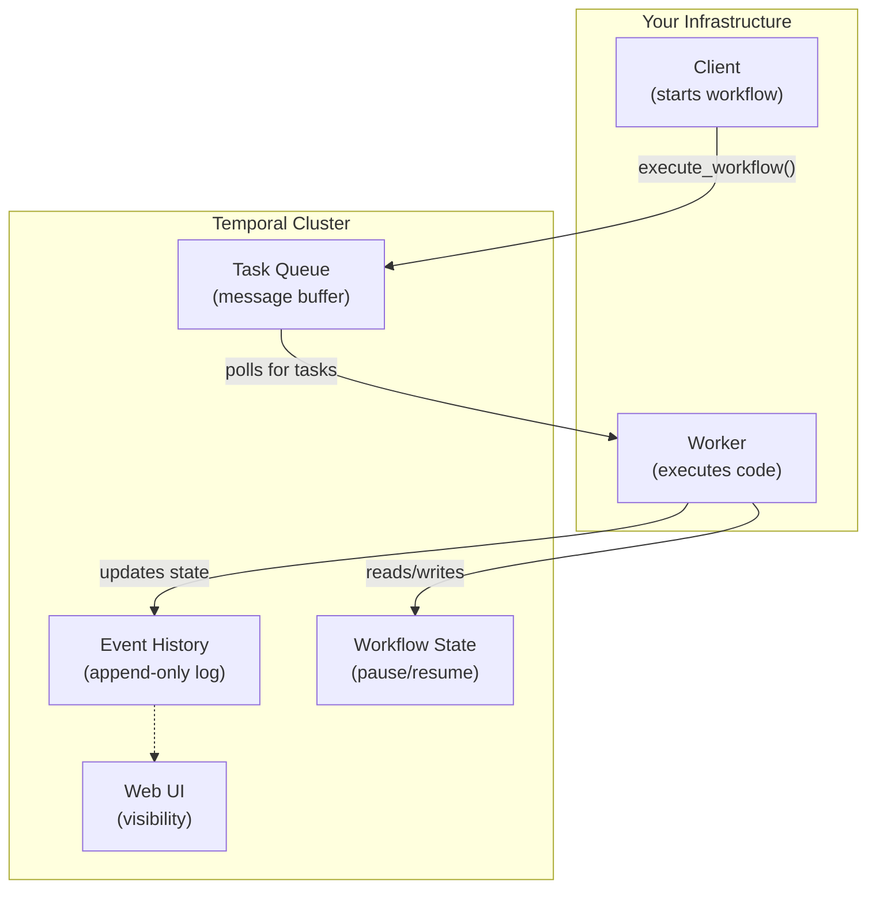
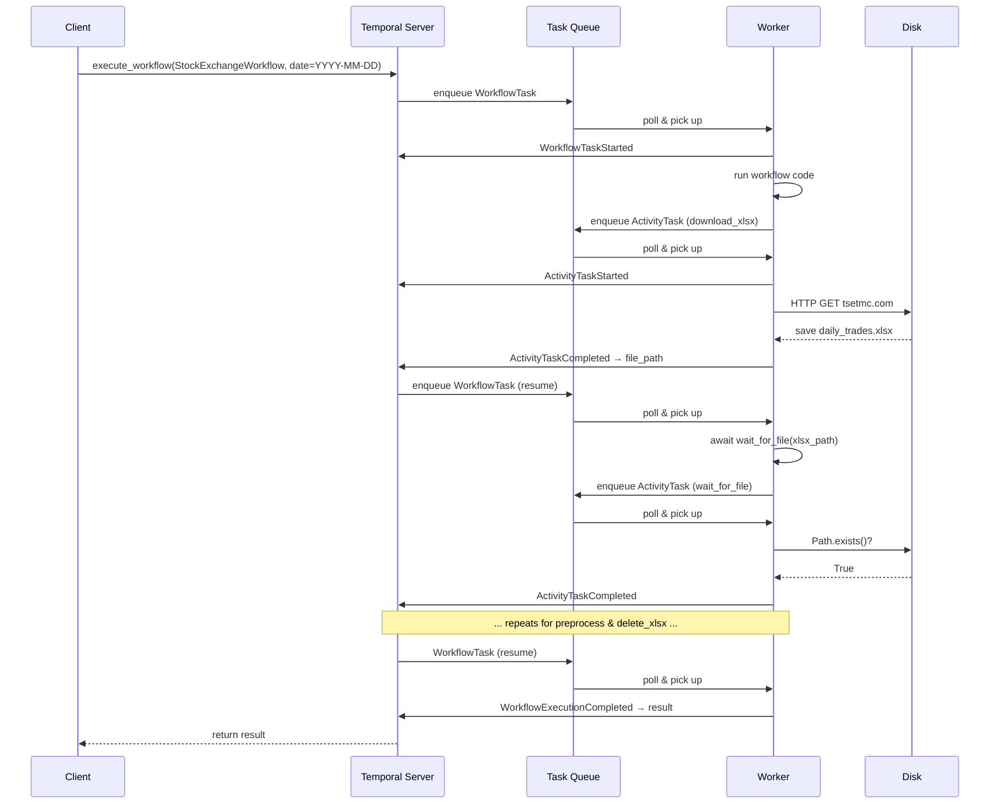
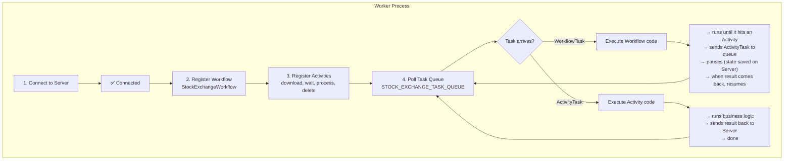
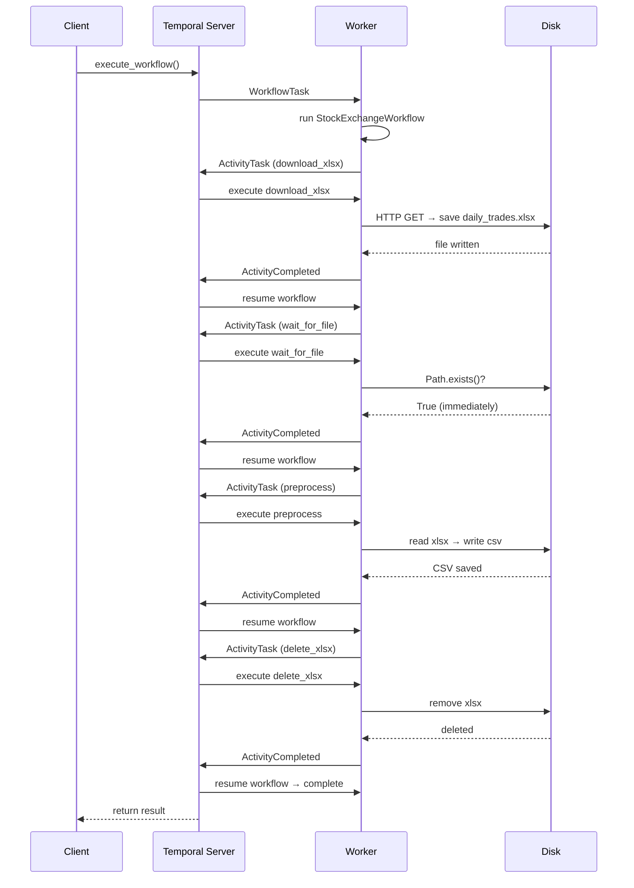

# Temporal Self-Learning Tutorial — Stock Exchange Pipeline

> Part 1 of 2. New here? Start at the [main README](./README.md) for prerequisites and the Temporal install guide. Finished this? Continue to [Workshop-Advanced.md](./Workshop-Advanced.md).

## Table of Contents

0. [Why Temporal? (When DAGs Aren't Enough)](#0-why-temporal-when-dags-arent-enough)
1. [Temporal Architecture](#1-temporal-architecture)
2. [How Workflows, Activities, Workers & the Server Fit Together](#2-how-everything-fits-together)
3. [Step-by-Step: Build the Stock Exchange App](#3-step-by-step-build-the-stock-exchange-app)
4. [Exercises for Self-Learning](#4-exercises-for-self-learning)
5. [Glossary](#5-glossary)

---

## 0. Why Temporal? (When DAGs Aren't Enough)

Before diving into the architecture, let's first understand *why* you might reach for Temporal in the first place — and when you should stick with DAG-based tools like Airflow, Prefect, or Dagster.

### 0.1 The Pain — What Breaks in DAG-Based Orchestration

If you've used Airflow in production, you've likely hit these walls:

| Pain Point | What It Looks Like |
|---|---|
| **XCom hacks** | Passing state between tasks via a metadata database never designed for it. Fragile, serialized, single-point-of-failure. |
| **Sensor stalls** | A poke-mode sensor holds a worker slot for minutes or hours while polling for an external event. That worker can't do anything else. |
| **Retry spaghetti** | Task-level retries with no memory of what happened before the failure. Did the API call go through? Did the file get written? No one knows. |
| **Async workaround** | Calling an async API or waiting on a webhook means custom operators, Deferrable Operators (Airflow 2.2+), or bolting on Celery/Kafka. It's never one DAG. |
| **Human-in-the-loop** | Pausing for approval requires external state storage and polling hacks. The DAG has no native concept of "waiting for someone to click Approve." |

Temporal addresses all five — not as workarounds, but as *primary, documented patterns.*

### 0.2 Two Mental Models Side by Side

| Dimension | Airflow / Prefect / Dagster | Temporal |
|---|---|---|
| **Core abstraction** | DAG — a static graph of tasks | Workflow function — plain code with durable state |
| **State lives in** | Metadata DB (XCom, task instance table) | Event History — append-only log on server |
| **Failure recovery** | Restart from last checkpoint or full re-run | Resume at exact line via history replay |
| **Async execution** | Opt-in via Deferrable Operators; requires custom setup | Async-first by architecture; no special operators needed |
| **Polyglot teams** | Single language per orchestrator (Python) | Go, Python, TypeScript, Java, .NET — same server |
| **Human-in-the-loop** | External DB + polling hack | Native `workflow.wait_condition()` + Signal |

The key insight: in Temporal, the *workflow function is the state machine.* There is no external metadata DB to sync against.

### 0.3 Honest Trade-offs — What You Gain and What You Keep

**Keep Airflow / Dagster for:**

| Use case | Why |
|---|---|
| Batch ETL pipelines with known, bounded duration | DAG model is a perfect fit |
| Data lineage tracking (column-level) | OpenLineage, Marquez integrations are native |
| Data-aware scheduling (run when dataset is ready) | Airflow Datasets, Dagster Asset Sensors |
| Business analyst visibility into pipeline status | Visual DAG UI is purpose-built for non-engineers |

**Move to Temporal for:**

| Use case | Why |
|---|---|
| Long-running operations (hours to days) | Durable execution; no timeout risk |
| Event-driven, async coordination | Push-based, Signal-native |
| Human-in-the-loop workflows | Native wait + signal; no external state DB |
| Cross-system distributed transactions (Saga pattern) | If step 3 of 5 fails, undo steps 1-2 automatically |
| Infrastructure provisioning + orchestration | Polyglot, ops-team-friendly |
| Microservice choreography | One platform, multiple language SDKs |

### 0.4 The One-Line Summary

> Temporal runs your business logic. Airflow runs your data pipelines. The mistake is making one do both.

This tutorial builds a real-world pipeline (Stock Exchange data download → transform → CSV) on Temporal. The code is simple. The architecture is what makes it powerful.

---

## 1. Temporal Architecture

Before writing any code, you need a mental model of how Temporal works.  
Let's start with the big picture.

### The Big Picture



### The 5 Core Components

| # | Component | What is it? | Analogy |
|---|---|---|---|
| 1 | **Temporal Server** (Cluster) | The brain. Receives commands, tracks state, schedules tasks, stores history. You run it with `.\temporal server start-dev`. | The **operating system** of your application |
| 2 | **Task Queue** | A named channel (like a message queue) where tasks wait to be picked up. Workflows and Activities both use it. | A **to-do list** that workers check |
| 3 | **Worker** | Your long-running process that polls the Task Queue and executes Workflow & Activity code. | A **factory worker** pulling items off the conveyor belt |
| 4 | **Workflow** | Code that defines **what to do and in what order**. Must be **deterministic** (same input = same output). | The **blueprint / recipe** |
| 5 | **Activity** | Code that does **actual work** — HTTP calls, file I/O, databases. Can fail and be retried independently. | The **chef** who actually cooks |

> **Polyglot by design:** Workers, workflows, and activities can be written in **different languages** — all on the same Temporal Server. Each Worker only registers the activities it owns. For example, a Go activity runs on a Go Worker, while 3 Python activities run on a Python Worker. Both poll the same Task Queue.
>
> **But the workflow file imports Python activities — what if an activity is in Go?** The import via `workflow.unsafe.imports_passed_through()` is only for Python's type system. Under the hood, `execute_activity_method()` just tells the Server: *"schedule the activity named `StockExchangeActivities.download_xlsx`"* — it never calls the Python code directly. If that activity were implemented in Go instead, the Python workflow would call it the same way; the Go Worker would pick up the task and execute it.
>
> ```python
> # Python workflow calling a Go activity by string name
> result = await workflow.execute_activity(
>     "send_email",                          # string name — matches what Go Worker registered
>     EmailPayload(to="user@example.com"),   # serializable input
>     start_to_close_timeout=timedelta(seconds=30),
> )
> ```
>
> The Go Worker registers `send_email` and the Python Worker doesn't — each Worker only owns its activities, all sharing the same Task Queue.

### What Makes Temporal Different?

In a normal Python app, if you write:

```python
x = download_file()      # step 1
y = process_file(x)      # step 2
z = upload_file(y)       # step 3
```

If the process crashes at step 2, **everything is lost**. You have to start over.  
You'd need to write extra code — save state to a database, checkpoints, retry logic, etc.

**Temporal does this for you automatically.**  
When the Worker crashes, Temporal remembers *exactly* where the workflow paused.  
When the Worker comes back, execution resumes from the **next line of code** — not from the beginning.

This is possible because:
1. The Worker sends every event (task started, task completed, etc.) to the **Event History** on the Temporal Server
2. The Workflow code is **replayable** — Temporal can re-run it from the Event History to reconstruct state
3. All non-deterministic work (HTTP, file I/O) is **isolated in Activities**

---

## 2. How Everything Fits Together

### The Full Lifecycle of a Workflow Execution

```
                    ┌──────────────┐
                    │   CLIENT     │
                    │ (your script)│
                    └──────┬───────┘
                           │
                           │ 1. execute_workflow()
                           │    "Start StockExchangeWorkflow
                           │     with date=YYYY-MM-DD"
                           ▼
              ┌────────────────────────┐
              │    TASK QUEUE          │
              │  "STOCK_EXCHANGE..."   │
              │                        │
              │  [WorkflowTask]        │  ← a "to-do" item appears
              └────────────────────────┘
                           │
                           │ 2. Worker polls & finds the task
                           ▼
              ┌────────────────────────┐
              │      WORKER            │
              │                        │
              │  Runs Workflow code:   │
              │  xlsx = download...()  │
              │                        │
              │  This calls an         │
              │  Activity → puts       │
              │  ActivityTask on queue │
              └────────────────────────┘
                           │
                           │ 3. ActivityTask appears
                           ▼
              ┌────────────────────────┐
              │    TASK QUEUE          │
              │  [ActivityTask]        │
              └────────────────────────┘
                           │
                           │ 4. Worker (same or different) picks it
                           ▼
              ┌────────────────────────┐
              │      WORKER            │
              │  Runs Activity code:   │
              │  requests.get(TSETMC)  │
              │  write file to disk    │
              │  return file_path      │
              └────────────────────────┘
                           │
                           │ 5. Result sent back to Server
                           │    → Event History updated
                           ▼
              ┌───────────────────────────────────────────────┐
              │   TEMPORAL SERVER                             │
              │  Event History:                               │
              │  [1] WorkflowStarted                          │
              │  [2] ActivityTaskScheduled (download_xlsx)    │
              │  [3] ActivityTaskStarted                      │
              │  [4] ActivityTaskCompleted                    │
              │  [5] WorkflowTaskScheduled ← Worker resumes   │
              └───────────────────────────────────────────────┘
                           │
                           │ 6. Worker wakes up, gets the result
                           │    moves to next line of code
                           ▼
              ┌────────────────────────┐
              │      WORKER            │
              │  await wait_for_file(  │
              │    xlsx_path)          │
              │  → puts new Activity   │
              └────────────────────────┘
```



### The Data Flow

```
┌────────────────────────────────────────────────────────────────────┐
│                        WORKFLOW                                     │
│                                                                     │
│  @workflow.defn                                                     │
│  class StockExchangeWorkflow:                                       │
│    async def run(self, input):                                     │
│      ds = input.execution_date          ← input from client         │
│                                                                     │
│      xlsx_path = await execute_activity(                            │
│        download_xlsx, ds)               ← call activity, get result │
│                                                                     │
│      await execute_activity(                                        │
│        wait_for_file, xlsx_path)        ← pass result to next       │
│                                                                     │
│      csv_path = await execute_activity(                             │
│        preprocess, xlsx_path)           ← pass result to next       │
│                                                                     │
│      await execute_activity(                                        │
│        delete_xlsx, xlsx_path)          ← cleanup                   │
│                                                                     │
│      return {"status": "completed"}    ← final result to client     │
└────────────────────────────────────────────────────────────────────┘
        │                      │
        │    data flows via    │
        │   Temporal Server    │
        ▼                      ▼
┌──────────────────┐  ┌──────────────────┐
│  Activity        │  │  Activity        │
│  download_xlsx   │  │  preprocess      │
│                  │  │                  │
│  - HTTP call     │  │  - read Excel    │
│  - write to disk │  │  - transform data│
│  - return path   │  │  - write CSV     │
│                  │  │  - return path   │
└──────────────────┘  └──────────────────┘
```

### Key Rules to Remember

| Rule | Why? |
|---|---|
| **Workflows must be deterministic** | Temporal replays them from Event History. Randomness, current time, or external calls in a Workflow break replay. |
| **Put non-deterministic code in Activities** | HTTP, file I/O, randomness, timestamps — all go in `@activity.defn` methods. |
| **Use `asyncio.to_thread()` for blocking calls** | Activities run on the event loop. Blocking it with `requests.get(...)` stops the entire worker. |
| **Always set `start_to_close_timeout`** | If an activity hangs, this timeout prevents it from running forever. |
| **Use `workflow.unsafe.imports_passed_through()`** | Inside the workflow file, wrap imports that contain non-deterministic code so Temporal doesn't try to record them during replay. |

## 3. Step-by-Step: Build the Stock Exchange App

We'll build the app incrementally. Each step adds one piece and explains *why*.

> **Prerequisites:** This tutorial uses Python `async/await` extensively. You should be comfortable with `asyncio`, coroutines, and `await` before proceeding. If you're new to async Python, read the [asyncio docs](https://docs.python.org/3/library/asyncio.html) first.

### Step 0: Project Setup

We'll use `uv` — a fast Python project & package manager.  
If you don't have it: `pip install uv` or visit https://docs.astral.sh/uv/.

```bash
# Create the app directory & initialize a Python project
mkdir Stock-Exchange-Temporal-App
cd Stock-Exchange-Temporal-App
uv init --bare

# Create virtual environment
uv venv

# Activate it
.venv\Scripts\activate

# Install dependencies (temporalio, data processing, HTTP, Persian dates)
uv add temporalio pandas openpyxl requests jdatetime
```

### Step 1: Create Shared Types (`shared.py`)

**File:** `shared.py`

```python
from dataclasses import dataclass
from pathlib import Path

# The name of the channel where tasks will be sent and received
STOCK_EXCHANGE_TASK_QUEUE = "STOCK_EXCHANGE_TASK_QUEUE"

# File paths and naming conventions
# Files are stored in a local data/ subdirectory next to this file
EXCEL_FILE_PATH = str(Path(__file__).parent / "data")
EXCEL_FILE_NAME = "daily_trades"
EXCEL_FILE_EXT_XLSX = "xlsx"
EXCEL_FILE_EXT_CSV = "csv"


@dataclass
class StockExchangeInput:
    """Single input object for the workflow.
    
    Using a dataclass instead of loose parameters makes it easy to
    add fields later WITHOUT breaking running workflows.
    """
    execution_date: str  # format: "YYYY-MM-DD"


@dataclass
class StockExchangeBackfillInput:
    """Input for the parent backfill workflow."""
    start_date: str  # format: "YYYY-MM-DD"
    end_date: str    # format: "YYYY-MM-DD"
```

**Why is this file separate?**
- Both the Workflow and the Client need to agree on the input type
- Constants are defined in one place — change them once, not in every file
- The dataclass is recorded in the Event History — versioning matters

### Step 2: Create the Activities (`activities.py`)

**File:** `activities.py`

```python
import asyncio
import os
from datetime import datetime
from pathlib import Path

import jdatetime      # Persian (Jalali) calendar library
import pandas as pd   # Data processing
import requests       # HTTP client

from temporalio import activity

from shared import EXCEL_FILE_PATH, EXCEL_FILE_NAME, EXCEL_FILE_EXT_XLSX, EXCEL_FILE_EXT_CSV


def is_symbol(row):
    """Filter: keep only rows where the symbol name (نماد) has 
    fewer than 20 digits (these are the 'real' stocks, not 
    index-like instruments)."""
    try:
        return int("".join(filter(str.isdigit, row["نماد"]))) < 20
    except Exception:
        return True


class StockExchangeActivities:
    """All business logic lives here — NOT in the Workflow."""

    @activity.defn
    async def download_xlsx(self, ds: str) -> str:
        """Step 1: Download the daily Excel file from TSETMC."""
        file_path = str(Path(EXCEL_FILE_PATH) / f"{EXCEL_FILE_NAME}_{ds}.{EXCEL_FILE_EXT_XLSX}")
        activity.logger.info(f"Downloading XLSX from TSETMC for date {ds}")

        # ⚠ Blocking HTTP call → wrapped in asyncio.to_thread
        #    so the worker's event loop stays responsive
        response = await asyncio.to_thread(
            requests.get,
            f"https://members.tsetmc.com/tsev2/excel/MarketWatchPlus.aspx?d={ds}",
            headers={"User-Agent": "Chrome/61.0"},
        )
        response.raise_for_status()

        Path(EXCEL_FILE_PATH).mkdir(parents=True, exist_ok=True)
        with open(file_path, "wb") as f:
            f.write(response.content)

        return file_path

    @activity.defn
    async def wait_for_file(self, file_path: str) -> None:
        """Step 2: Poll until the file exists on disk.
        
        This mirrors Airflow's FileSensor. In practice, since we
        just downloaded the file in the previous activity, this 
        will likely succeed immediately — but it's a safety net.
        """
        while not await asyncio.to_thread(Path(file_path).exists):
            activity.logger.info(f"Waiting for file {file_path}...")
            await asyncio.sleep(10)

    @activity.defn
    async def preprocess(self, xlsx_path: str) -> str | None:
        """Step 3: Read Excel, add dates, filter, write CSV.

        Returns the CSV path on success, or None if the XLSX is empty
        (e.g., a non-trading day like Friday in Iran).
        """
        ds = Path(xlsx_path).stem.split("_")[-1]
        csv_path = str(Path(EXCEL_FILE_PATH) / f"{EXCEL_FILE_NAME}_{ds}.{EXCEL_FILE_EXT_CSV}")

        en_date = datetime.strptime(ds, "%Y-%m-%d").date()
        fa_date = jdatetime.date.fromgregorian(date=en_date)

        activity.logger.info(f"Processing {xlsx_path} -> {csv_path}")

        # ⚠ Blocking file I/O → wrapped in asyncio.to_thread
        df = await asyncio.to_thread(
            pd.read_excel, xlsx_path, header=0, skiprows=2, engine="openpyxl"
        )
        if df.empty:
            activity.logger.info(f"Empty XLSX for {ds} (non-trading day). Skipping CSV.")
            return None
        df = df.assign(fa_date=fa_date.strftime("%Y-%m-%d"), en_date=ds, fa_year=fa_date.year)
        df = df[df.apply(is_symbol, axis=1)]
        await asyncio.to_thread(df.to_csv, csv_path, index=False, header=True, encoding="utf-8")

        return csv_path

    @activity.defn
    async def delete_xlsx(self, xlsx_path: str) -> None:
        """Step 4: Clean up the raw Excel file. Idempotent — silently
        ignores missing files (e.g., when preprocess skipped CSV generation)."""
        activity.logger.info(f"Deleting {xlsx_path}")
        try:
            await asyncio.to_thread(os.remove, xlsx_path)
        except FileNotFoundError:
            pass
```

**What to notice:**

| Detail | Why it matters |
|---|---|
| `@activity.defn` | Registers the method as a Temporal Activity |
| `activity.logger.info(...)` | Logs appear in the Temporal Web UI and terminal — great for debugging |
| `await asyncio.to_thread(...)` | Wraps blocking calls so the async event loop doesn't freeze |
| `-> str` return types | Return values are recorded in the Event History and passed to the next step |
| File paths as strings | Temporal serializes inputs/outputs — strings, numbers, dataclasses all work |
| **Why a class?** | Activities are grouped into a class so the Worker can register all methods at once (`activities=[activities.download_xlsx, ...]`). The class also gives you a place to share state (e.g., a DB connection) across activities if you ever need it. |
| **`is_symbol()` is a plain function** | It's pure data logic with no I/O — it doesn't need `@activity.defn`. Only methods called from a Workflow need to be activities. |

### Step 3: Create the Workflow (`workflows.py`)

**File:** `workflows.py`

```python
from datetime import timedelta

from temporalio import workflow
from temporalio.common import RetryPolicy

# ⚠ Imports inside this block are NOT checked for determinism.
#    The workflow only imports TYPE references (class names),
#    it never calls Activity code directly here.
with workflow.unsafe.imports_passed_through():
    from activities import StockExchangeActivities
    from shared import StockExchangeInput


@workflow.defn
class StockExchangeWorkflow:
    """Orchestrates the 4 steps of the pipeline.
    
    A Workflow is just a class with a @workflow.defn decorator.
    The @workflow.run method is the entry point.
    """

    @workflow.run
    async def run(self, input: StockExchangeInput) -> dict:
        ds = input.execution_date

        # Retry Policy: if an Activity fails, retry up to 3 times
        # with exponential backoff (max 10s between retries).
        retry_policy = RetryPolicy(
            maximum_attempts=3,
            maximum_interval=timedelta(seconds=10),
        )

        # ── Step 1: Download ─────────────────────────────────
        xlsx_path = await workflow.execute_activity_method(
            StockExchangeActivities.download_xlsx,
            ds,
            start_to_close_timeout=timedelta(minutes=5),
            retry_policy=retry_policy,
        )

        # ── Step 2: Wait for file ────────────────────────────
        await workflow.execute_activity_method(
            StockExchangeActivities.wait_for_file,
            xlsx_path,
            start_to_close_timeout=timedelta(minutes=10),
            retry_policy=retry_policy,
        )

        # ── Step 3: Process ──────────────────────────────────
        csv_path = await workflow.execute_activity_method(
            StockExchangeActivities.preprocess,
            xlsx_path,
            start_to_close_timeout=timedelta(minutes=5),
            retry_policy=retry_policy,
        )

        # ── Step 4: Cleanup ──────────────────────────────────
        await workflow.execute_activity_method(
            StockExchangeActivities.delete_xlsx,
            xlsx_path,
            start_to_close_timeout=timedelta(seconds=30),
            retry_policy=retry_policy,
        )

        return {"xlsx_path": xlsx_path, "csv_path": csv_path, "data_found": csv_path is not None, "status": "completed"}
```

**Why each parameter of `execute_activity_method`:**

```
workflow.execute_activity_method(
    StockExchangeActivities.download_xlsx,    # Which activity to call
    ds,                                       # Input argument(s)
    start_to_close_timeout=timedelta(minutes=5),  # Max wall-clock time
    retry_policy=retry_policy,                # How to handle failures
)
```

| Parameter | Purpose |
|---|---|
| First argument | The Activity method reference (not a call — no parentheses!) |
| Second argument | The input data to pass to the Activity |
| `start_to_close_timeout` | If the Activity takes longer than this, Temporal marks it as failed and retries |
| `retry_policy` | Controls retry count, backoff, and which errors NOT to retry |

**Why activities can't be called directly:**

You might wonder: why not just call `download_xlsx(ds)` directly in the workflow?  
Because that would make the workflow **non-deterministic** — it would depend on network latency, file system state, etc.  
Temporal would not be able to replay it.

`workflow.execute_activity_method(...)` tells Temporal:
> "Schedule this activity, record it in Event History, and give me the result when it's done."

### Step 4: Create the Worker (`run_worker.py`)

**File:** `run_worker.py`

```python
import asyncio

from temporalio.client import Client
from temporalio.worker import Worker

from activities import StockExchangeActivities
from shared import STOCK_EXCHANGE_TASK_QUEUE
from workflows import StockExchangeWorkflow, StockExchangeBackfillParentWorkflow


async def main() -> None:
    # Connect to the Temporal Server running on localhost:7233
    client = await Client.connect("localhost:7233", namespace="default")

    # Instantiate the activities object
    activities = StockExchangeActivities()

    # Create a Worker that listens on the Task Queue
    worker = Worker(
        client,
        task_queue=STOCK_EXCHANGE_TASK_QUEUE,
        workflows=[StockExchangeWorkflow, StockExchangeBackfillParentWorkflow],          # List of workflow classes
        activities=[                                # List of activity methods
            activities.download_xlsx,
            activities.wait_for_file,
            activities.preprocess,
            activities.delete_xlsx,
        ],
    )

    # Start polling — this runs forever until you press Ctrl+C
    await worker.run()


if __name__ == "__main__":
    asyncio.run(main())
```

**What the Worker does:**

```
┌──────────────────────────────────────────────────────┐
│                     WORKER                            │
│                                                       │
│  1. Connect to Server ────────────────────► OK        │
│  2. Register Workflow: StockExchangeWorkflow          │
│  3. Register Activities: download, wait, process,     │
│     delete                                            │
│  4. Poll Task Queue "STOCK_EXCHANGE_TASK_QUEUE"       │
│     ┌──────────────────────────────────┐              │
│     │  [poll]──►[poll]──►[poll]──►...  │              │
│     └──────────────────────────────────┘              │
│                                                       │
│  When a task arrives:                                 │
│  ┌──────────────────────────────────────┐             │
│  │  Execute Workflow code               │             │
│  │  → runs until it hits an Activity    │             │
│  │  → sends ActivityTask to queue       │             │
│  │  → pauses (state saved on Server)    │             │
│  │  → when Activity result comes back,  │             │
│  │    resumes from next line            │             │
│  └──────────────────────────────────────┘             │
└──────────────────────────────────────────────────────┘
```



### Step 5: Create the Client (`run_workflow.py`)

**File:** `run_workflow.py`

```python
import asyncio
import sys

from temporalio.client import Client

from shared import STOCK_EXCHANGE_TASK_QUEUE, StockExchangeInput
from workflows import StockExchangeWorkflow


async def main() -> None:
    # Connect to the Temporal Server as a CLIENT (not a Worker).
    # "namespace" defaults to "default" — same as the Worker.
    client = await Client.connect("localhost:7233")

    # Accept a date from the CLI, default to 2026-05-18 (verified trading day).
    ds = sys.argv[1] if len(sys.argv) > 1 else "2026-05-18"
    input_data = StockExchangeInput(execution_date=ds)

    # Ask the Server to start a Workflow Execution
    result = await client.execute_workflow(
        StockExchangeWorkflow.run,          # The workflow method to run
        input_data,                          # Input payload
        id="stock-exchange-workflow-001",   # Unique Workflow ID
        task_queue=STOCK_EXCHANGE_TASK_QUEUE,  # Which queue to use
    )

    print(f"Result: {result}")


if __name__ == "__main__":
    asyncio.run(main())
```

**What `execute_workflow` does:**

1. Connects to the Temporal Server
2. Tells it: "Schedule a `StockExchangeWorkflow.run` with these inputs on this Task Queue"
3. The Server creates a **Workflow Task** and places it on the Task Queue
4. A Worker picks it up and starts executing
5. The `execute_workflow` call **waits** for the final result (it's an `await`)
6. When the workflow completes, the result is returned

**The Workflow ID** is important:

```python
id="stock-exchange-workflow-001"
```

- Must be unique among **open** workflows
- If you start a second workflow with the same ID while the first is still running, the Server rejects it
- This is how Temporal prevents **duplicate executions**
- A completed workflow's ID is "free" — you can reuse it after completion
- To re-run with the same date, change the ID (e.g., append a timestamp) or wait for the previous run to complete

> **Note on namespaces:** Both the Worker and the Client must use the **same namespace** (default = `"default"`). The Worker explicitly passes `namespace="default"`; the Client omits it and uses the same default. Namespaces isolate different environments (e.g., `prod`, `staging`) on the same server.

### Step 6: Run Everything

Now let's see all the pieces in action.

> **Prerequisite:** We assume `temporal.exe` is in the current folder. All CLI examples use `.\temporal` to run it.

**Terminal 1 — Start the Temporal Dev Server:**

```bash
.\temporal server start-dev
```

> ⚠ **Data is transient by default.** Without persistence, all workflow state, event history, and metadata are lost when the server stops. To persist across restarts, add `--db-filename`:
> ```bash
> .\temporal server start-dev --db-filename temporal.db
> ```
>
> This stores the data in a local SQLite file. Restarting the server with the same file recovers all workflows, schedules, and history.

This starts:
- The Temporal Server on `localhost:7233`
- The Web UI on `http://localhost:8233`

Open the Web UI in your browser — you'll see an empty dashboard.

> **Namespaces in the Web UI:** Look at the left sidebar — there's a namespace selector (default: `default`). A **Namespace** is the fundamental isolation unit in Temporal. It groups workflow executions, task queues, and resources under a logical boundary. Workflow IDs only need to be unique *within* a namespace, not across namespaces.
>
> To create a new namespace:
> ```bash
> .\temporal operator namespace create workshop
> ```
>
> Once created, pass it to your client and worker code:
> ```python
> client = await Client.connect("localhost:7233", namespace="workshop")
> worker = Worker(client, ..., namespace="workshop")
> ```
>
> You can run multiple namespaces on the same Temporal Server — useful for separating dev, staging, and production.

**Terminal 2 — Start the Worker:**

```bash
uv run run_worker.py
```

The Worker connects to the server and starts polling the Task Queue.  
It logs something like:

```
INFO  No logger configured for temporal client. Created default one.
INFO  Started Worker Namespace default TaskQueue STOCK_EXCHANGE_TASK_QUEUE ...
```

**Terminal 3 — Start the Workflow:**

```bash
uv run run_workflow.py                    # default: 2026-05-18
uv run run_workflow.py 2026-05-20         # custom date
```

After a few seconds (depending on download speed), you'll see:

```
Result: {'xlsx_path': '.../data/daily_trades_2026-05-18.xlsx', 'csv_path': '.../data/daily_trades_2026-05-18.csv', 'status': 'completed'}
```

**What happened (timeline):**

```
Time  Client              Server              Worker              Disk
│     │                    │                   │                   │
│     │ execute_workflow() │                   │                   │
│     │───────────────────►│                   │                   │
│     │                    │ WorkflowTask      │                   │
│     │                    │ ────────────────► │                   │
│     │                    │                   │ download_xlsx()   │
│     │                    │                   │ request.get(...)  │
│     │                    │                   │──────────────────►│ writes file
│     │                    │                   │◄──────────────────│ done
│     │                    │ ActivityCompleted │                   │
│     │                    │◄──────────────────│                   │
│     │                    │                   │ wait_for_file()   │
│     │                    │                   │ Path.exists()     │
│     │                    │                   │ (immediately true)│
│     │                    │ ActivityCompleted │                   │
│     │                    │◄──────────────────│                   │
│     │                    │                   │ preprocess()      │
│     │                    │                   │ pd.read_excel()   │
│     │                    │                   │ df.to_csv()       │
│     │                    │                   │──────────────────►│ writes CSV
│     │                    │ ActivityCompleted │                   │
│     │                    │◄──────────────────│                   │
│     │                    │                   │ delete_xlsx()     │
│     │                    │                   │──────────────────►│ removes XLSX
│     │                    │ WorkflowCompleted │                   │
│     │◄───────────────────│                   │                   │
│  result returned         │                   │                   ▼
```



### Step 6.5: Handle Non-Trading Days (Empty XLSX Files)

TSETMC returns data only for **trading days** — Saturdays through Wednesdays in Iran. For Fridays, public holidays, and any other non-trading day, the API still responds but with an essentially empty Excel file (headers only, no rows).

**What we do about it:**

The `preprocess` activity checks if the loaded DataFrame is empty. If so, it logs the skip and returns `None` — no CSV is written. The `delete_xlsx` activity is **idempotent** (silently ignores missing files), so cleanup still works:

```python
@activity.defn
async def preprocess(self, xlsx_path: str) -> str | None:
    # ... read xlsx into df ...
    if df.empty:
        activity.logger.info(f"Empty XLSX for {ds} (non-trading day). Skipping CSV.")
        return None
    # ... write CSV ...
    return csv_path

@activity.defn
async def delete_xlsx(self, xlsx_path: str) -> None:
    try:
        await asyncio.to_thread(os.remove, xlsx_path)
    except FileNotFoundError:
        pass  # already gone — nothing to do
```

**Workflow result for a non-trading day:**

```python
{
    "xlsx_path": ".../data/daily_trades_2026-05-15.xlsx",
    "csv_path": None,
    "data_found": False,
    "status": "completed"
}
```

**For backfill**, the result includes counts:

```python
{
    "start_date": "2026-05-16",
    "end_date": "2026-06-15",
    "dates_processed": 31,
    "trading_days": 22,   # CSVs produced
    "empty_days": 9,      # skipped (Fridays + holidays)
    "status": "completed"
}
```

> **Why `data/` is gitignored:** The downloaded XLSX and generated CSV files are runtime artifacts — they shouldn't be committed. The root `.gitignore` excludes `data/` so it's never accidentally tracked.

### Step 7: Verify in the Web UI

1. Go to [http://localhost:8233](http://localhost:8233)
2. You should see `stock-exchange-workflow-001` listed with status `Completed`
3. Click on it to see:
   - **Input/Output** tab — shows the `StockExchangeInput` you passed and the result dict
   - **Timeline** — a Gantt-chart view of each activity with its duration
   - **History** — every single event from start to finish. This is the **append-only log** that makes Temporal reliable.

### Step 8: Backfill — One Workflow Per Day

A common real-world need: *"Process every trading day for the last 6 months."*

The naive approach — one long workflow looping through dates — creates a massive Event History and makes the Web UI hard to navigate. A better approach: **launch a separate workflow for each day**. Each day is independently traceable, retryable, and visible in its own row in the UI.

**`run_backfill.py`** — launches one `StockExchangeWorkflow` per date:

```python
import asyncio
import sys
from datetime import datetime, timedelta

from temporalio.client import Client

from shared import STOCK_EXCHANGE_TASK_QUEUE, StockExchangeInput
from workflows import StockExchangeWorkflow


def date_range(start: str, end: str):
    start_d = datetime.strptime(start, "%Y-%m-%d").date()
    end_d = datetime.strptime(end, "%Y-%m-%d").date()
    current = start_d
    while current <= end_d:
        yield current.strftime("%Y-%m-%d")
        current += timedelta(days=1)


async def launch_one(client, date: str):
    return await client.start_workflow(
        StockExchangeWorkflow.run,
        StockExchangeInput(execution_date=date),
        id=f"stock-exchange-backfill-{date}",
        task_queue=STOCK_EXCHANGE_TASK_QUEUE,
    )


def get_default_dates():
    """Return (start, end) defaulting to last 30 days ending today."""
    end = datetime.now().date()
    start = end - timedelta(days=30)
    return start.strftime("%Y-%m-%d"), end.strftime("%Y-%m-%d")


async def main() -> None:
    start = sys.argv[1] if len(sys.argv) > 1 else None
    end = sys.argv[2] if len(sys.argv) > 2 else None

    if not start and not end:
        # Neither provided: default to last 30 days
        start, end = get_default_dates()
        print(f"No date range provided. Using default (last 30 days): {start} -> {end}")
    elif start and not end:
        # Only start provided: default end to today
        end = datetime.now().date().strftime("%Y-%m-%d")
        print(f"End date not provided. Using today as end: {start} -> {end}")

    if end < start:
        start, end = end, start
        print(f"Dates reversed — swapping to: {start} -> {end}")

    client = await Client.connect("localhost:7233")
    dates = list(date_range(start, end))
    print(f"Launching {len(dates)} workflows ({start} -> {end})")

    handles = [await launch_one(client, d) for d in dates]
    results = await asyncio.gather(*(h.result() for h in handles))

    trading = sum(1 for r in results if r.get("data_found"))
    empty = len(results) - trading
    print(f"Done: {trading} trading days, {empty} empty days")


if __name__ == "__main__":
    asyncio.run(main())
```

#### What's Happening Under the Hood

Three Temporal patterns at play:

1. **`client.start_workflow` (vs `execute_workflow`)** — non-blocking. Returns a handle immediately; you collect results later with `handle.result()`. This is what enables parallelism.
2. **`asyncio.gather`** — waits for all handles' results concurrently. All workflows run in parallel (subject to the Worker's activity slot limits).
3. **Per-day Workflow ID** — `f"stock-exchange-backfill-{date}"` makes each day independently searchable, retryable, and cancelable in the UI.

**Comparison with the old approach:**

| | Old (one long workflow) | New (per-day workflows) |
|---|---|---|
| Workflow count | 1 | N (one per day) |
| Event History | Bloated, single file | Bounded, one per day |
| UI navigation | One huge row | Sortable, filterable list |
| Per-day retry | Restart the whole batch | Reset/terminate one workflow |
| Per-day status | Hard to spot failures | Clear pass/fail per row |

#### Run It

```bash
uv run run_backfill.py                    # default: last 30 days (today - 30d -> today)
uv run run_backfill.py 2026-05-01 2026-05-31   # custom range
uv run run_backfill.py 2026-05-01              # start only → end = today
uv run run_backfill.py 2026-06-15 2026-06-01   # swapped automatically → 2026-06-01 -> 2026-06-15
```

Output (example with default 30-day range):

```
No date range provided. Using default (last 30 days): 2026-05-16 -> 2026-06-15
Launching 31 workflows (2026-05-16 -> 2026-06-15)
Done: 22 trading days, 9 empty days
```

> **Partial arguments:** If only `start` is given, `end` defaults to today. If `end` comes before `start`, dates are swapped automatically.

Open the Web UI (http://localhost:8233) — you'll see one row per date (e.g. 31 rows with the default 30-day range), each named `stock-exchange-backfill-YYYY-MM-DD`. Filter by status, sort by date, click any row to see its isolated Event History.

> **Note:** Non-trading days (Fridays in Iran, public holidays) are detected by `preprocess` (empty DataFrame) and produce `data_found: false`. See Step 6.5 for details.

### Step 8.5: Choosing a Backfill Pattern

The per-day approach (Step 8) is one of three valid patterns. Each has trade-offs:

| Pattern | Workflows | Per-day isolation | Single logical unit | UI navigation | Per-day retry | Best for |
|---|---|---|---|---|---|---|
| **Per-day workflows** (client-side `start_workflow` × N) | N children, 0 parent | ✅ | ❌ (just N rows) | Sortable list | Reset one row | Many independent days, no aggregate state needed |
| **Parent + ChildWorkflows** (this step) | N children, 1 parent | ✅ | ✅ | Hierarchical tree | Reset one child | Aggregate metrics + per-day isolation |
| **Single long workflow with `continue_as_new`** | 1 logical, N executions | ❌ (resets each chunk) | ✅ | Linear chain | Restart the chunk | Tight coupling, shared state between days |

**Use the per-day pattern (Step 8) when:**
- You don't need aggregate metrics across the range
- You want maximum parallelism with zero coordination
- Each day is truly independent

**Use the parent + child pattern (Step 8.6) when:**
- You need a single roll-up (e.g., "9 of 11 days succeeded")
- You want both aggregate *and* per-day visibility
- You need to coordinate between children (e.g., "stop the backfill if 3 days in a row fail")
- You want parent-level retry that doesn't re-run successful children

**Use single-workflow + `continue_as_new` when:**
- Each day depends on the previous day's output (running totals, stateful ETL)
- You can't tolerate the overhead of N workflows
- You need strict ordering

**Quick code illustration — `continue_as_new` in action:**

```python
@workflow.defn
class ChunkedBackfillWorkflow:
    @workflow.run
    async def run(self, input: StockExchangeBackfillInput) -> dict:
        start = datetime.strptime(input.start_date, "%Y-%m-%d").date()
        end = datetime.strptime(input.end_date, "%Y-%m-%d").date()
        chunk_size = 10  # days per execution

        results = []
        for i in range(chunk_size):
            d = (start + timedelta(days=i)).strftime("%Y-%m-%d")
            if d > input.end_date:
                break
            result = await workflow.execute_child_workflow(
                StockExchangeWorkflow.run,
                StockExchangeInput(execution_date=d),
                id=f"chunked-{d}",
            )
            results.append(result)

        # Continue as a new execution for the next chunk
        next_start = start + timedelta(days=chunk_size)
        if next_start <= end:
            workflow.continue_as_new(StockExchangeBackfillInput(
                start_date=next_start.strftime("%Y-%m-%d"),
                end_date=input.end_date,
            ))

        return {
            "dates_processed": len(results),
            "trading_days": sum(1 for r in results if r.get("data_found")),
        }
```

The workflow processes a chunk of 10 days, then calls `workflow.continue_as_new(...)` with the next starting date. The server starts a **fresh execution** with a clean Event History — no unbounded growth. Each chunk appears as a separate row in the Web UI, linked in a linear chain.

### Step 8.6: Parent + Child Workflows (Advanced)

The hierarchical approach: one parent workflow that spawns one child workflow per day. Each child is a real `StockExchangeWorkflow` execution. The parent waits for all children and aggregates the result.

**`workflows.py`** — add the parent workflow:

```python
@workflow.defn
class StockExchangeBackfillParentWorkflow:
    @workflow.run
    async def run(self, input: StockExchangeBackfillInput) -> dict:
        start = datetime.strptime(input.start_date, "%Y-%m-%d").date()
        end = datetime.strptime(input.end_date, "%Y-%m-%d").date()
        dates = []
        current = start
        while current <= end:
            dates.append(current.strftime("%Y-%m-%d"))
            current += timedelta(days=1)

        sem = asyncio.Semaphore(5)  # cap parallelism to 5 in flight

        async def run_one(d):
            async with sem:
                return await workflow.execute_child_workflow(
                    StockExchangeWorkflow.run,
                    StockExchangeInput(execution_date=d),
                    id=f"child-stock-exchange-{d}",
                    parent_close_policy=workflow.ParentClosePolicy.ABANDON,
                )

        results = await asyncio.gather(*(run_one(d) for d in dates), return_exceptions=True)

        successes = [r for r in results if isinstance(r, dict)]
        failures = [
            {"date": d, "error": str(r)}
            for d, r in zip(dates, results)
            if not isinstance(r, dict)
        ]
        trading = sum(1 for r in successes if r.get("data_found"))
        return {
            "start_date": input.start_date,
            "end_date": input.end_date,
            "dates_processed": len(dates),
            "trading_days": trading,
            "empty_days": sum(1 for r in successes if not r.get("data_found")),
            "failures": failures,
            "status": "completed" if not failures else "completed_with_failures",
        }
```

**`run_parent_backfill.py`** — client script:

```python
import asyncio
import sys
from datetime import datetime, timedelta

from temporalio.client import Client

from shared import STOCK_EXCHANGE_TASK_QUEUE, StockExchangeBackfillInput
from workflows import StockExchangeBackfillParentWorkflow


def get_default_dates():
    """Return (start, end) defaulting to last 30 days ending today."""
    end = datetime.now().date()
    start = end - timedelta(days=30)
    return start.strftime("%Y-%m-%d"), end.strftime("%Y-%m-%d")


async def main() -> None:
    start = sys.argv[1] if len(sys.argv) > 1 else None
    end = sys.argv[2] if len(sys.argv) > 2 else None

    if not start and not end:
        # Neither provided: default to last 30 days
        start, end = get_default_dates()
        print(f"No date range provided. Using default (last 30 days): {start} -> {end}")
    elif start and not end:
        # Only start provided: default end to today
        end = datetime.now().date().strftime("%Y-%m-%d")
        print(f"End date not provided. Using today as end: {start} -> {end}")

    if end < start:
        start, end = end, start
        print(f"Dates reversed — swapping to: {start} -> {end}")

    client = await Client.connect("localhost:7233")

    print(f"Launching parent backfill ({start} -> {end})...")
    handle = await client.start_workflow(
        StockExchangeBackfillParentWorkflow.run,
        StockExchangeBackfillInput(start_date=start, end_date=end),
        id=f"parent-stock-exchange-backfill-{start}-{end}",
        task_queue=STOCK_EXCHANGE_TASK_QUEUE,
    )
    print(f"Parent started: {handle.id}")
    print("Open the Web UI to watch parent + child workflows in real time.")

    result = await handle.result()
    print(f"Result: {result}")


if __name__ == "__main__":
    asyncio.run(main())
```

#### Four Temporal patterns at play

1. **`workflow.execute_child_workflow`** — starts a child workflow from within the parent. The child is a fully independent execution, with its own Event History, ID, and retry policy.
2. **`parent_close_policy=ParentClosePolicy.ABANDON`** — when the parent closes (success or failure), the children are *not* terminated. They keep running. This is critical: a parent that crashes shouldn't kill 151 already-running children.
3. **`asyncio.gather(..., return_exceptions=True)`** — collects both successes and failures. Without this, a single child failure would crash the parent and you'd lose visibility into which days succeeded.
4. **`asyncio.Semaphore(5)`** — caps the in-flight child count. Without it, all children would launch in parallel, hammer TSETMC, and get rate-limited.

#### Run it

```bash
uv run run_parent_backfill.py                    # default: last 30 days (today - 30d -> today)
uv run run_parent_backfill.py 2026-05-10 2026-05-20   # custom range
uv run run_parent_backfill.py 2026-05-10              # start only -> end = today
uv run run_parent_backfill.py 2026-06-15 2026-06-01   # swapped automatically → 2026-06-01 -> 2026-06-15
```

> **Partial arguments:** If only `start` is given, `end` defaults to today. If `end` comes before `start`, dates are swapped automatically.

**Sample result (with all 3 children failing due to TSETMC throttling):**

```json
{
  "dates_processed": 3,
  "trading_days": 0,
  "empty_days": 0,
  "failures": [
    {"date": "2026-05-02", "error": "Child Workflow execution failed"},
    {"date": "2026-05-03", "error": "Child Workflow execution failed"},
    {"date": "2026-05-04", "error": "Child Workflow execution failed"}
  ],
  "status": "completed_with_failures"
}
```

The parent **completes** (not fails) because of `return_exceptions=True`. You can see exactly which days failed and why, in the parent's result — no need to dig into the Web UI.

#### Web UI navigation

Open the Web UI. You'll see a **hierarchical view**:
- 1 parent workflow at the top
- N child workflows underneath, each linked to the parent
- Click the parent → see aggregate result + child summary
- Click any child → drill into its own Event History

This is the pattern that production teams use for data pipelines, ML training, and any "do this for many things" scenario.

### Step 9: Standalone Activities

Sometimes you need to run an activity *without* a workflow — for one-off data migrations, manual repairs, or testing activities in isolation. Temporal supports this via `client.execute_activity()`.

**`run_standalone_activity.py`** — run `preprocess` directly:

```python
import asyncio
import sys
import uuid
from datetime import timedelta
from pathlib import Path

from temporalio.client import Client

from activities import StockExchangeActivities
from shared import EXCEL_FILE_PATH, EXCEL_FILE_NAME, EXCEL_FILE_EXT_XLSX


async def main() -> None:
    if len(sys.argv) < 2:
        print("Usage: uv run run_standalone_activity.py <YYYY-MM-DD>")
        sys.exit(1)
    ds = sys.argv[1]

    client = await Client.connect("localhost:7233")
    activities = StockExchangeActivities()

    xlsx_path = str(Path(EXCEL_FILE_PATH) / f"{EXCEL_FILE_NAME}_{ds}.{EXCEL_FILE_EXT_XLSX}")
    if not Path(xlsx_path).exists():
        print(f"XLSX not found. Downloading {ds} as a standalone activity...")
        dl_id = f"standalone-download-{uuid.uuid4().hex[:8]}"
        xlsx_path = await client.execute_activity(
            activities.download_xlsx,
            ds,
            id=dl_id,
            task_queue="STOCK_EXCHANGE_TASK_QUEUE",
            schedule_to_close_timeout=timedelta(minutes=5),
        )
        print(f"Downloaded: {xlsx_path}")

    activity_id = f"standalone-preprocess-{uuid.uuid4().hex[:8]}"
    print(f"Executing preprocess activity (id={activity_id}) for {xlsx_path}...")
    result = await client.execute_activity(
        activities.preprocess,
        xlsx_path,
        id=activity_id,
        task_queue="STOCK_EXCHANGE_TASK_QUEUE",
        schedule_to_close_timeout=timedelta(minutes=5),
    )
    print(f"Result: {result}")


if __name__ == "__main__":
    asyncio.run(main())
```

**Run it:**

With the Worker running:

```bash
uv run run_standalone_activity.py 2026-06-14
```

Output (first run auto-downloads the XLSX):

```
XLSX not found. Downloading 2026-06-14 as a standalone activity...
Downloaded: .../data/daily_trades_2026-06-14.xlsx
Executing preprocess activity (id=standalone-preprocess-a1b2c3d4) for .../data/daily_trades_2026-06-14.xlsx...
Result: .../data/daily_trades_2026-06-14.csv
```

In the Web UI, the **Standalone Activities** tab now shows your activity execution. Click it to see the input, result, and timing.

### Step 10: Schedules

Schedules are Temporal's built-in cron replacement. Instead of an external scheduler (cron, Airflow, etc.), you define the schedule *inside* Temporal — and get pause/resume/trigger/list operations for free.

**`run_schedule.py`** — manage a daily schedule:

```python
import asyncio
import sys
from datetime import datetime, timedelta

from temporalio.client import (
    Client, Schedule, ScheduleActionStartWorkflow,
    ScheduleIntervalSpec, ScheduleSpec, ScheduleState,
)

from shared import STOCK_EXCHANGE_TASK_QUEUE, StockExchangeInput
from workflows import StockExchangeWorkflow

SCHEDULE_ID = "daily-stock-exchange"


async def create_schedule(client: Client) -> None:
    today = datetime.now().strftime("%Y-%m-%d")
    await client.create_schedule(
        SCHEDULE_ID,
        Schedule(
            action=ScheduleActionStartWorkflow(
                StockExchangeWorkflow.run,
                StockExchangeInput(execution_date=today),
                id=f"scheduled-stock-exchange-{today}",
                task_queue=STOCK_EXCHANGE_TASK_QUEUE,
            ),
            spec=ScheduleSpec(intervals=[ScheduleIntervalSpec(every=timedelta(hours=24))]),
            state=ScheduleState(note="Daily stock exchange workflow"),
        ),
    )
    print(f"Schedule '{SCHEDULE_ID}' created (runs every 24h).")


# ... list_schedule, pause_schedule, unpause_schedule, trigger_schedule, delete_schedule ...


async def main() -> None:
    action = sys.argv[1] if len(sys.argv) > 1 else "list"
    client = await Client.connect("localhost:7233")
    # dispatch to action handler...


if __name__ == "__main__":
    asyncio.run(main())
```

**Actions available:** `create`, `list`, `pause`, `unpause`, `trigger`, `delete`.

**Run it:**

```bash
uv run run_schedule.py create       # creates a 24h interval schedule
uv run run_schedule.py list         # shows next scheduled run
uv run run_schedule.py trigger      # fires immediately (don't wait for next interval)
uv run run_schedule.py pause        # pauses the schedule
uv run run_schedule.py unpause      # resumes
uv run run_schedule.py delete       # removes the schedule
```

The **Schedules** tab in the Web UI now shows your schedule, its action, and its next 5 run times. Click any past run to see the workflow it triggered.

> **Caveat:** The example uses `datetime.now()` for the input date. For a real production schedule, you would pass a *templated* date or use a `@workflow.dynamic` signal so the workflow uses *its own* start time, not the schedule's creation time. See Exercise 10 for this.

### Step 11: Batch Operations

The Temporal CLI can run an admin operation on **many workflows at once** — using a Visibility query. This is essential for cleanup, retargeting, and bulk-cancel scenarios.

**Use cases:**
- Cancel all running workflows for a workflow type
- Terminate workflows from a deleted Worker
- Reset workflows in a specific state

**CLI syntax:**

```bash
# Cancel all running StockExchangeWorkflow executions
.\temporal workflow cancel \
  --query "WorkflowType='StockExchangeWorkflow' AND ExecutionStatus='Running'" \
  --reason "Cleanup before deploy" \
  --yes

# Terminate all completed workflows older than 30 days
.\temporal workflow delete \
  --query "WorkflowType='StockExchangeWorkflow' AND CloseTime < '2026-05-01T00:00:00Z'" \
  --yes

# Reset all backfill workflows that failed
.\temporal workflow reset \
  --query "WorkflowId STARTS_WITH 'stock-exchange-backfill-' AND ExecutionStatus='Failed'" \
  --type LastWorkflowTask \
  --reason "Re-run failed backfills" \
  --yes

# Delete all completed workflows by CloseTime
.\temporal workflow delete \
  --query "CloseTime < '2026-06-20T00:00:00Z'" \
  --yes
```

<details>
<summary>PowerShell equivalent (use ` for line continuation)</summary>

```powershell
# Cancel all running StockExchangeWorkflow executions
.\temporal workflow cancel `
  --query "WorkflowType='StockExchangeWorkflow' AND ExecutionStatus='Running'" `
  --reason "Cleanup before deploy" `
  --yes

# Terminate all completed workflows older than 30 days
.\temporal workflow delete `
  --query "WorkflowType='StockExchangeWorkflow' AND CloseTime < '2026-05-01T00:00:00Z'" `
  --yes

# Reset all backfill workflows that failed
.\temporal workflow reset `
  --query "WorkflowId STARTS_WITH 'stock-exchange-backfill-' AND ExecutionStatus='Failed'" `
  --type LastWorkflowTask `
  --reason "Re-run failed backfills" `
  --yes

# Delete all completed workflows by CloseTime
.\temporal workflow delete `
  --query "CloseTime < '2026-06-20T00:00:00Z'" `
  --yes
```
</details>

Each command creates a **batch job**. You can monitor it:

```bash
.\temporal batch list                  # list all batch jobs
.\temporal batch describe --job-id <id> # details + progress
```

The **Batch Operations** tab in the Web UI shows the same information visually.

> **Tip:** Always use a `WorkflowType` filter to avoid touching workflows you don't own. A naked `--query 'ExecutionStatus="Running"'` could cancel every running workflow in the namespace.

### The Complete File Structure

```
Stock-Exchange-Temporal-App/
│
├── __init__.py                  # Makes the folder a Python package
├── shared.py                    # Data types & constants
├── activities.py                # Business logic (4 activities)
├── workflows.py                 # Orchestration (2 workflows: single + parent backfill)
├── run_worker.py                # Worker process
├── run_workflow.py              # Client — single day
├── run_backfill.py              # Client — one workflow per day in a date range
├── run_parent_backfill.py       # Client — parent + child workflows (hierarchical)
├── run_standalone_activity.py   # Client — run a single activity directly
├── run_schedule.py              # Client — manage Temporal Schedules
└── README.md                    # This file
```

---

## 4. Exercises for Self-Learning

Try these after you've run the app successfully. Each exercise teaches one Temporal concept.

### Exercise 1: Change the Retry Policy

**Goal:** Understand how retries work.

In `workflows.py`, change:

```python
retry_policy = RetryPolicy(
    maximum_attempts=1,   # was 3
    maximum_interval=timedelta(seconds=2),
)
```

Then trigger a failure by modifying `preprocess` in `activities.py` to raise an error:

```python
@activity.defn
async def preprocess(self, xlsx_path: str) -> str:
    raise ValueError("Something went wrong!")
```

**Run the workflow again. What happens?**  
Check the Event History in the Web UI — you should see `ActivityTaskFailed` followed by `WorkflowExecutionFailed`.

### Exercise 2: Fix a Running Workflow

**Goal:** Experience live debugging.

1. Keep the broken `preprocess` from Exercise 1
2. Start the workflow (it will fail)
3. **Without starting over**, fix the code (remove the `raise ValueError`)
4. Restart the Worker
5. **Re-run the workflow with a NEW Workflow ID**

Now it succeeds. Notice how the state of the *failed* run is still visible in the Web UI for debugging.

### Exercise 3: Add a New Activity

**Goal:** Learn how to extend the pipeline.

Add a new activity after `preprocess` that reads the CSV and prints the number of rows:

```python
@activity.defn
async def count_rows(self, csv_path: str) -> int:
    import pandas as pd
    df = await asyncio.to_thread(pd.read_csv, csv_path)
    count = len(df)
    activity.logger.info(f"CSV has {count} rows")
    return count
```

Then update the workflow to call it and include the count in the result.

**What changes need to happen?**
1. `activities.py` — add the new method
2. `workflows.py` — add the `execute_activity_method` call and update the return dict
3. `run_worker.py` — add `activities.count_rows` to the list
4. Restart the Worker

### Exercise 4: Try Running Two Workflows in Parallel

**Goal:** See how Temporal handles multiple executions.

Open **two** terminals and run `run_workflow.py` in both at the same time.

Actually, you can't — both use Workflow ID `stock-exchange-workflow-001` and the second one will be rejected.

Change the ID in `run_workflow.py` to be dynamic:

```python
import sys
workflow_id = f"stock-exchange-{input_data.execution_date}"
```

Then run both with different dates, or just run the same script twice — now they run in parallel.

### Exercise 5: Crash the Worker Mid-Activity

**Goal:** Verify Temporal's durability.

1. Start the workflow
2. While `download_xlsx` is running (you can see the logs), press `Ctrl+C` in the Worker terminal
3. Wait 5 seconds, then restart the Worker
4. The workflow **resumes** from where it stopped

Check the Web UI — the Event History shows the gap in time between the crash and the resume.

### Exercise 6: Run Backfill and Inspect the UI

**Goal:** Test the per-day backfill approach.

Run with a small range first:

```bash
uv run run_backfill.py 2026-05-10 2026-05-20
```

**Tasks:**
- Open the Web UI. How many workflow rows appear?
- Filter by status — which dates show `Completed` vs which show different states?
- Click any single date's workflow. Look at its Event History — count the events. (Hint: a single trading day should have ~50 events.)
- Try re-running the same command. What happens? (Hint: same IDs, all rejected — see "Why" below.)

**Why same-ID re-runs fail:** Each `stock-exchange-backfill-YYYY-MM-DD` ID is unique. If the workflow is still in the namespace's history, Temporal rejects the duplicate. To re-run, either delete the workflows first (Exercise 9) or use a different ID strategy.

### Exercise 7: Rate-Limit the Backfill

**Goal:** Learn why raw parallelism can be dangerous.

The current `run_backfill.py` launches all workflows in parallel. If TSETMC rate-limits at, say, 10 requests/second, you'll get a flood of failures.

Modify the script to limit concurrency using `asyncio.Semaphore`:

```python
sem = asyncio.Semaphore(10)

async def launch_one(client, date):
    async with sem:
        return await client.start_workflow(...)
```

**Question:** How does the run time change? Does the failure rate drop?

### Exercise 8: Trigger and Pause a Schedule

**Goal:** Verify Temporal Schedule controls.

```bash
uv run run_schedule.py create
uv run run_schedule.py list         # see next run time
uv run run_schedule.py trigger      # fires immediately
uv run run_schedule.py pause        # pauses
uv run run_schedule.py list         # next run unchanged
uv run run_schedule.py unpause      # resumes
uv run run_schedule.py delete       # cleanup
```

**Tasks:**
- Open the Web UI's **Schedules** tab. Does your schedule appear?
- After `trigger`, does a new workflow row appear?
- After `delete`, does the schedule disappear?

### Exercise 9: Batch-Terminate All Backfill Workflows

**Goal:** Clean up the namespace using batch operations.

After running several backfills, the namespace has many completed workflows. Use a batch operation to clean them up:

```bash
# List backfill workflows
.\temporal workflow list \
  --query "WorkflowId STARTS_WITH 'stock-exchange-backfill-'" \
  --limit 10

# Delete completed backfill workflows
.\temporal workflow delete \
  --query "WorkflowId STARTS_WITH 'stock-exchange-backfill-' AND ExecutionStatus='Completed'" \
  --reason "Cleanup after tutorial"
```

<details>
<summary>PowerShell equivalent (use ` for line continuation)</summary>

```powershell
# List backfill workflows
.\temporal workflow list `
  --query "WorkflowId STARTS_WITH 'stock-exchange-backfill-'" `
  --limit 10

# Delete completed backfill workflows
.\temporal workflow delete `
  --query "WorkflowId STARTS_WITH 'stock-exchange-backfill-' AND ExecutionStatus='Completed'" `
  --reason "Cleanup after tutorial"
```
</details>

**Tasks:**
- Run the `list` first to preview.
- Run `batch list` to see the batch job that was created.
- Re-run the backfill. Does it now succeed? (Because the old IDs are gone.)

### Exercise 10: Make the Schedule Use the Workflow's Own Date

**Goal:** Pass a dynamic date to the scheduled workflow.

The current schedule hardcodes `datetime.now()` at *schedule creation* time. The workflow should use *its own start time* instead.

**Approach:** Make the workflow read its own start time and format it as `YYYY-MM-DD`, ignoring the input date.

**Hint:** Inside a workflow, call `workflow.info().start_time` to get the workflow's start time (a `datetime` object). Then format it:

```python
from datetime import datetime

@workflow.run
async def run(self, input: StockExchangeInput) -> dict:
    # Use the workflow's own start time, not the input date
    start_time = workflow.info().start_time
    ds = start_time.strftime("%Y-%m-%d")
    # ... rest of workflow
```

This way, every scheduled run automatically uses the correct date — no hardcoded `datetime.now()` at schedule creation time.

### Exercise 11: Compare Backfill Patterns in the Web UI

**Goal:** See the three patterns side by side.

Run all three backfill approaches on the same date range:

```bash
uv run run_backfill.py 2026-06-01 2026-06-05           # per-day
uv run run_parent_backfill.py 2026-06-01 2026-06-05    # parent + child
```

**Tasks:**
- Open the Web UI after each run
- For **per-day**: count the workflow rows (5 rows, all `StockExchangeWorkflow`)
- For **parent + child**: count the rows (1 parent + 5 children = 6 rows), then click the parent to see the hierarchical view
- Note the difference: per-day is flat; parent + child is a tree
- In the parent's result, look at the `failures` field — which dates failed? Why?

**Question to answer:** If you wanted to re-run just one failed date, which approach makes that easier?

---

## 5. Glossary

| Term | Definition |
|---|---|
| **Temporal Server** | The backend service that manages Workflow state, schedules tasks, and records Event History. Think of it as the "database" for your Workflow executions. |
| **Task Queue** | A named channel (like a message queue topic) where Workflow Tasks and Activity Tasks are placed. Workers poll this queue to find work. |
| **Worker** | Your application process that polls the Task Queue and executes Workflow and Activity code. Must register the Workflow types and Activity methods it supports. |
| **Workflow** | Code that defines the orchestration logic — what steps to run and in what order. Must be **deterministic** (no random, no I/O, no clocks). |
| **Activity** | Code that performs actual work — HTTP calls, file I/O, databases, ML inference. Can be retried independently. |
| **Workflow Task** | A task that tells the Worker to execute a chunk of Workflow code (e.g., "run lines 10-20 of the Workflow"). |
| **Activity Task** | A task that tells the Worker to execute an Activity function. |
| **Event History** | An append-only log of everything that happened during a Workflow Execution. Used for replay, debugging, and audit. |
| **Replay** | The process of re-executing a Workflow from its Event History to reconstruct its current state. This is how Temporal recovers from crashes. |
| **Retry Policy** | Configuration for automatic retries of failed Activities: max attempts, backoff interval, non-retryable error types. |
| **Start-to-Close Timeout** | Maximum wall-clock time an Activity is allowed to run from start to completion. |
| **Workflow ID** | A unique identifier for a Workflow Execution. Used for deduplication and to look up running or completed workflows. |
| **Determinism** | The property that given the same input, code always produces the same output. Temporal Workflows must be deterministic to support replay. |
| **`asyncio.to_thread()`** | Python's built-in way to run a blocking (synchronous) function in a separate thread without blocking the async event loop. |
| **Jalali (Persian) Calendar** | The official calendar of Iran. `jdatetime` is the Python library that converts between Gregorian and Jalali dates. |
| **TSETMC** | Tehran Stock Exchange Technology Management Co. — the source of daily trading data. |
